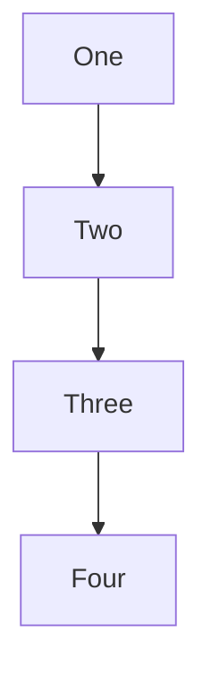
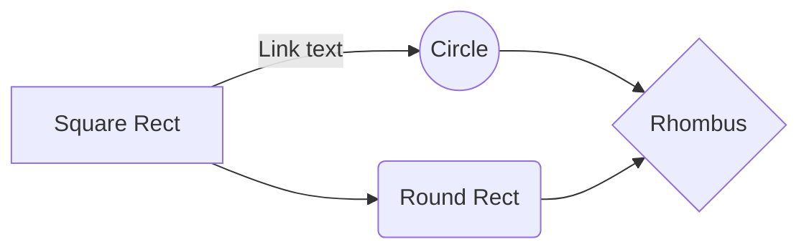
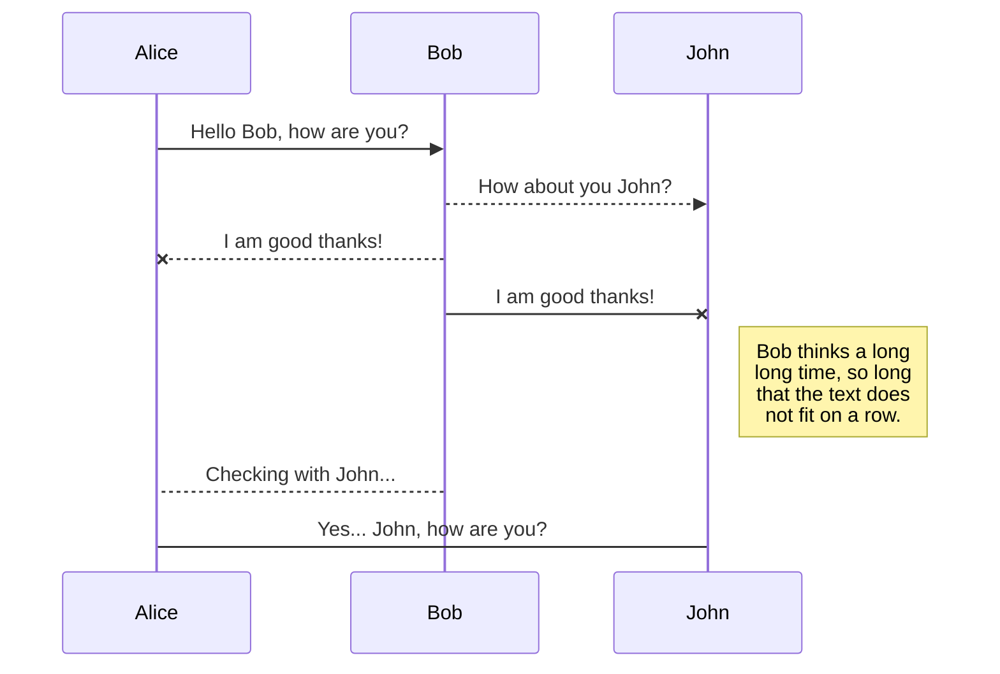
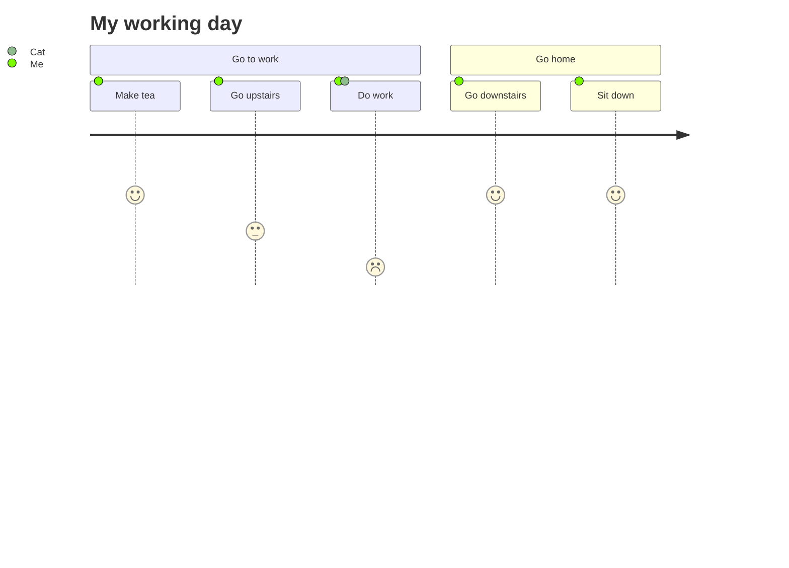
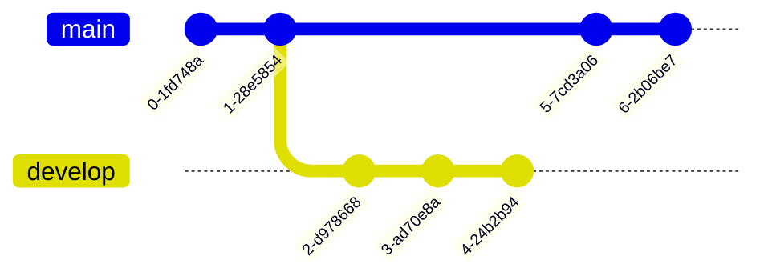
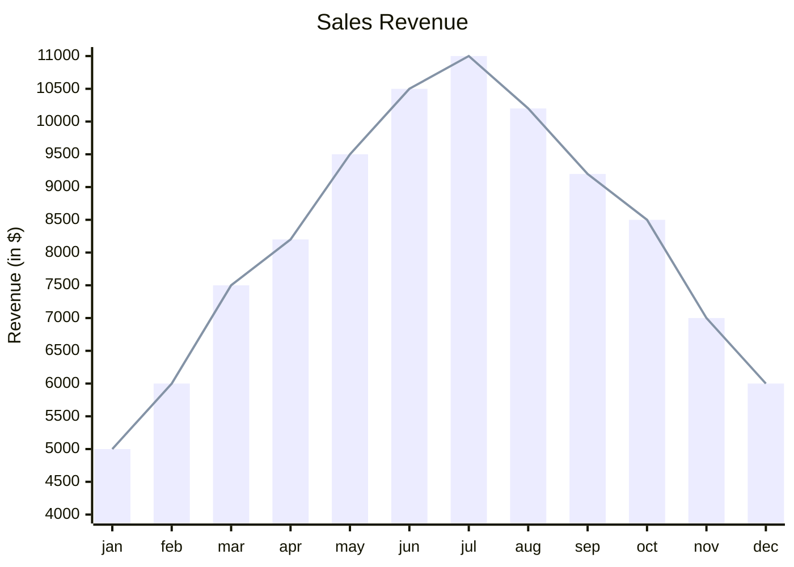
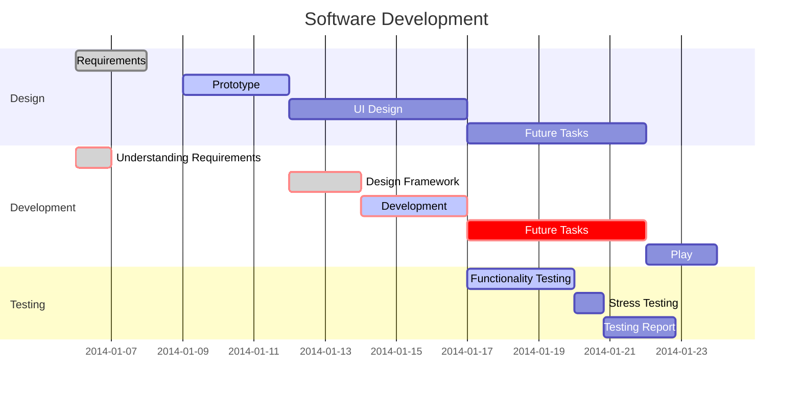

```mermaid
gantt
    title Profit and Discount by Product
    dateFormat  X
    section Product 1
    Profit :done, p1profit, 0, 48
    Discount :done, p1discount, 48, 26
    section Product 2
    Profit :done, p2profit, 0, 30
    Discount :done, p2discount, 30, 15
    section Product 3
    Profit :done, p3profit, 0, 28
    Discount :done, p3discount, 28, 13
    section Product 4
    Profit :done, p4profit, 0, 23
    Discount :done, p4discount, 23, 16
    section Product 5
    Profit :done, p5profit, 0, 21
    Discount :done, p5discount, 21, 12
    section Product 6
    Profit :done, p6profit, 0, 18
    Discount :done, p6discount, 18, 11
```

# <div align="center"><h1><a id="markdownguide">&nbsp;&nbsp;&nbsp;&nbsp;𝗠𝗔𝗥𝗞𝗗𝗢𝗪𝗡 𝗚𝗨𝗜𝗗𝗘 <sup><kbd>Pro</kbd></sup></a><br></h1><a href="https://docs.github.com/en"></a> <a href="https://daringfireball.net/projects/markdown"></a> <a href="https://html.spec.whatwg.org/multipage"></a> <a href="https://developer.mozilla.org/en-US/docs/Web/CSS"></a> <a href="https://symbl.cc/en/unicode-table"></a> <a href="https://www.latex-project.org/"></a> <a href="https://mermaid.js.org"></a> <a href="https://www.blender.org"></a> <a href="https://shields.io"></a></div>
<h3 align="center">Markdown is a lightweight markup language that converts text into structured HTML.</h3>
<h4 align="center">The following guide will help you understand how to use Markdown.</h4></h4>

<table align="center"><tbody><tr></tr><th>
<details align="center"><summary>&nbsp;<menu><strong>MENU</strong></menu><dd><kbd>𝖨𝗇𝗍𝖾𝗋𝗇𝖺𝗅 𝖫𝗂𝗇𝗄𝗌 𝖮𝖿 𝖠𝗅𝗅 𝖯𝖺𝗋𝖺𝗀𝗋𝖺𝗉𝗁𝗌</kbd></dd></summary><br>
  <table align="center">
    <tbody align="left">
      <tr>
        <th>
          <a href="#headings">Headings</a><br>
          <a href="#stylingtext">Styling Text</a><br>
          <a href="#linebreaks">Paragraphs and Line Breaks</a><br>
          <a href="#lists">Lists</a><br>
          <a href="#links">Links</a><br>
          <a href="#images">Images</a><br>
          <a href="#video">Video</a><br>
          <a href="#code">Code</a><br>
          <a href="#quoting">Quoting Text</a><br>
          <a href="#line">Horizontal Line</a><br>
          <a href="#tables">Tables</a><br>
          <a href="#tasks">Tasks</a><br>
          <a href="#alerts">Alerts</a><br>
          <a href="#comments">Comments</a><br>
          <a href="#collapsibles">Collapsibles</a><br>
          <a href="#emoji">Emoji</a><br>
          <a href="#html">HTML</a><br>
          <a href="#characters">Characters</a><br>
          <a href="#mathtext">Math Styling Text</a><br>
          <a href="#math">Math Blocks</a><br>
          <a href="#diagrams">Diagrams</a><br>
          <a href="#charts">Charts</a><br>
          <a href="#maps">Maps</a><br>
          <a href="#3d">3D Models</a><br>
          <a href="#footnotes">Footnotes</a><br>
        </th>
      </tr>
    </tbody>
  </table>
</details>
</th></tbody></table>

<br>

## <a id="headings">Headings</a><a href="#markdownguide"></a>
```
# First level header
## Second level header
### Third level header
#### Fourth level header
##### Fifth level header
###### Sixth level header
```

<details>
  <summary>Headings as HTML</summary>
 <p>
   
```
<h1>First level header</h1>
<h2>Second level header</h2>
<h3>Third level header</h3>
<h4>Fourth level header</h4>
<h5>Fifth level header</h5>
<h6>Sixth level header</h6>
```
 </p>
</details>

***Example:***

# First level header
## Second level header
### Third level header
#### Fourth level header
##### Fifth level header
###### Sixth level header

---
<br>

## <a id="stylingtext">Styling Text</a><a href="#markdownguide"></a>
### Italic
```
*italic*  
_italic_
```

<details>
  <summary>Italic as HTML</summary>
 <p>
   
```
<i>italic</i>
<em>italic</em>
<var>italic</var>
```

 </p>
</details>

***Example:***

*italic*  
_italic_

---

### Bold
```
**bold**  
__bold__
```

<details>
  <summary>Bold as HTML</summary>
 <p>
   
```
<b>bold</b>
<strong>bold</strong>
```

 </p>
</details>

***Example:***

**bold**  
__bold__

---

### Bold Italic
```
***bold italic***  
___bold italic___
```

<details>
  <summary>Bold Italic as HTML</summary>
 <p>
   
```
<b><i>bold italic</i></b>
<strong><em>bold italic</em></strong>
```

 </p>
</details>

***Example:***

***bold italic***  
___bold italic___

---

### Strikethrough
```
~~strikethrough~~
```

<details>
  <summary>Strikethrough as HTML</summary>
 <p>
   
```
<s>strikethrough</s>
<del>strikethrough</del>
```

 </p>
</details>

***Example:***

~~strikethrough~~

---

<details>
  <summary>Superscript and Subscript as HTML</summary>
  <p>

### Superscript
```
This is a <sup>superscript</sup> text
```
***Example:***

This is a <sup>superscript</sup> text

---

### Subscript
```
This is a <sub>subscript</sub> text
```
***Example:***

This is a <sub>subscript</sub> text

  </p>
</details>

---
<br>

## <a id="linebreaks">Paragraphs and Line Breaks</a><a href="#markdownguide"></a>
```
This is a paragraph. To create a new paragraph, leave a blank line between two lines of text.

This is the first line  
And this is the second line, but they are in the same paragraph. To move a line, use two spaces at the end of the previous line.
```
***Example:***

This is a paragraph. To create a new paragraph, leave a blank line between two lines of text.

This is the first line  
And this is the second line, but they are in the same paragraph. To move a line, use two spaces at the end of the previous line.

---

<details>
  <summary>Line Breaks as HTML</summary>
 <p>
   
```
This is the first line <br> And this is the second line
```
or
```
<dd>This is the first line</dd> And this is the second line
```
***Example:***

This is the first line <br> And this is the second line

 </p>
</details>

---
<br>

## <a id="lists">Lists</a><a href="#markdownguide"></a>
### Numbered List
```
1. Paragraph one
2. Paragraph two
3. Paragraph three
```

<details>
  <summary>Numbered List as HTML</summary>
 <p>
   
```
<ol>
  <li>Paragraph one</li>
  <li>Paragraph two</li>
  <li>Paragraph three</li>
</ol>
```
 </p>
</details>

***Example:***

1. Paragraph one
2. Paragraph two
3. Paragraph three

---

### Marked List
```
- Bullet point one
- Bullet point two
- Bullet point three
```

<details>
  <summary>Marked List as HTML</summary>
 <p>
   
```
<ul>
  <li>Paragraph one</li>
  <li>Paragraph two</li>
  <li>Paragraph three</li>
</ul>
```
 </p>
</details>

***Example:***

- Bullet point one
- Bullet point two
- Bullet point three

---

### Nested List
You can create a nested list by indenting one or more list items below another item.
```
1. First list item
    - First nested list item
    - First nested list item
2. First list item
    - First nested list item
        + Second nested list item
        + Second nested list item
    - First nested list item
        * Second nested list item
        * Second nested list item
```

<details>
  <summary>Nested List as HTML</summary>
 <p>
   
```
<ol>
  <li>First list item</li>
  <ul>
    <li>First nested list item</li>
    <li>First nested list item</li>
  </ul>
  <li>First list item</li>
  <ul>
    <li>First nested list item</li>
    <ul>
      <li>Second nested list item</li>
      <li>Second nested list item</li>
    </ul>
  </ul>
  <ul>
    <li>First nested list item</li>
    <ul>
      <li>Second nested list item</li>
      <li>Second nested list item</li>
    </ul>
  </ul>
</ol>
```
 </p>
</details>

***Example:***

1. First list item
    - First nested list item
    - First nested list item
2. First list item
    - First nested list item
        + Second nested list item
        + Second nested list item
    - First nested list item
        * Second nested list item
        * Second nested list item

---
<br>

## <a id="links">Links</a><a href="#markdownguide"></a>
```
[Link Text](https://www.example.com)
```
***Example:***

[Link Text](https://www.example.com)

---

### Automatic Links
```
<http://example.com/>

<address@example.com>
```
***Example***

<http://example.com/>

<address@example.com>

---

### Reference-style Links
Reference-style links allow you to refer to your links by names, which you define elsewhere in your document:
```
I get 10 times more traffic from [Google][1] than from
[Yahoo][2] or [MSN][3].

[1]: http://google.com/        "Google"
[2]: http://search.yahoo.com/  "Yahoo Search"
[3]: http://search.msn.com/    "MSN Search"
```

<details>
  <summary>Reference-style Links as HTML</summary>
 <p>
   
```
<p>I get 10 times more traffic from <a href="http://google.com/"
title="Google">Google</a> than from <a href="http://search.yahoo.com/"
title="Yahoo Search">Yahoo</a> or <a href="http://search.msn.com/"
title="MSN Search">MSN</a>.</p>
```

 </p>
</details>

***Example***

I get 10 times more traffic from [Google][1] than from
[Yahoo][2] or [MSN][3].

[1]: http://google.com/        "Google"
[2]: http://search.yahoo.com/  "Yahoo Search"
[3]: http://search.msn.com/    "MSN Search"

---

### Internal Links
```
[Some Title 1](#some-title-1)

## Some Title 1
Some content
```
***Example:***

[Some Title 1](#some-title-1)

## Some Title 1
Some content

---

### Title Link as HTML
```
[Go to Title 1](#title1)

## <a id="title1">Title 1</a>
Some content
```
***Example:***

[Go to Title 1](#title1)

## <a id="title1">Title 1</a>
Some content

---
<br>

## <a id="images">Images</a><a href="#markdownguide"></a>

> `10MB` for images and gifs

```

```
***Example:***

/photo/images.jpg)

---

### Custom Image Size As HTML
```

```
***Example:***


---

> [!tip]
> <details><summary>How to upload images</summary>
>  <p> 
>      
> 1. Drag-and-drop an image on to the description field. This will start the uploading process.
> 
> 2. Copy the URL and use it in README, issues or pull requests however you like.
> 
> 
> 
>  </p>
> </details>

---
<br>

## <a id="video">Video</a><a href="#markdownguide"></a>

Image tags that link to files with a video extension are automatically converted to a video player. The valid video extensions are `.mp4`, `.m4v`, `.mov`, `.webm`, and `.ogv`.

> `10MB` for videos uploaded to a repository owned by a user or organization on a free GitHub plan
> 
> `100MB` for videos uploaded to a repository owned by a user or organization on a free GitHub plan

If the video is short, you can insert the video via drag and drop into a Markdown file.
```
https://github.com/user-attachments/assets/964af541-a09b-4569-be9d-5d3a826b8d49
```
***Example:***

https://github.com/user-attachments/assets/964af541-a09b-4569-be9d-5d3a826b8d49

---

### Link to YouTube videos can be embedded with a preview image.
```
[](https://www.youtube.com/watch?v=xREYX-AHii0&list=PL0lo9MOBetEE_p_lL10nji8nVTuzYT580)
```
***Example:***

[/photo/youtube-video-preview.png)](https://www.youtube.com/watch?v=xREYX-AHii0&list=PL0lo9MOBetEE_p_lL10nji8nVTuzYT580)

---

### Custom Video Size As HTML
```
[](https://www.youtube.com/watch?v=xREYX-AHii0&list=PL0lo9MOBetEE_p_lL10nji8nVTuzYT580)
```
***Example:***

[](https://www.youtube.com/watch?v=xREYX-AHii0&list=PL0lo9MOBetEE_p_lL10nji8nVTuzYT580)

---
<br>

## <a id="code">Code</a><a href="#markdownguide"></a>
### Code Line
```
`line of code`
```

<details>
  <summary>Code Line as HTML</summary>
 <p>

```
<code>line of code</code>
```
 </p>
</details>
   
***Example:***

`line of code`

---

### Code Block
Block of code can be written in multiple lines.

For blocks of code, use three <code>```</code> or `~~~`.

~~~
```
def main():
    message = "Hello, World!"
    print(message)

if __name__ == "__main__":
    main()
```
~~~
***Example:***

```
def main():
    message = "Hello, World!"
    print(message)

if __name__ == "__main__":
    main()
```

---

### Code Highlighting
You can specify the programming language for code blocks.

Syntax highlighting from the `linguist` library, which includes many different languages, is used.

~~~
```python
print("Hello World!")
```
~~~
***Example:***

```python
print("Hello World!")
```

---

### Git `diff` Сode
~~~
```diff
type demo struct {
-   text in red
+   text in green
!   text in orange
#   text in gray
@@  text in purple (and bold)@@
}
```
~~~
***Example:***

```diff
type demo struct {
-   text in red
+   text in green
!   text in orange
#   text in gray
@@  text in purple (and bold)@@
}
```

---

### Demonstrate Code
To demonstrate how to display the code, place the block in `~~~`.
<pre>
~~~
```python
print("Hello World!")
```
~~~
</pre>
***Example:***

~~~python
```python
print("Hello World!")
```
~~~

---

### Preservation Of Original Formatting
The `<pre>` tag in HTML is used to display text in a format that preserves all spaces and line breaks as they are written in the source code. 
```
<pre>
This is the text inside the "pre" tag.

    It preserves all spaces and
  line breaks.

    function example() {
        console.log("Hello, world!");
    }
</pre>
```

***Example:***

<pre>
This is the text inside the "pre" tag.
  
    It preserves all spaces and
  line breaks.

    function example() {
        console.log("Hello, world!");
    }
</pre>

---

> [!tip]
> <details><summary>Top Code Languages</summary>
>  <p>
>      
> | Language     | Keyword      |
> | :----------: | :----------: |
> | Bash         | bash         |
> | C#           | csharp       |
> | Clojure      | clojure      |
> | C++          | cpp          |
> | CSS          | css          |
> | CoffeeScript | coffeescript |
> | CMake        | cmake        |
> | HTML         | html         |
> | HTTP         | http         |
> | Java         | java         |
> | JavaScript   | javascript   |
> | JSON         | json         |
> | Markdown     | markdown     |
> | Objective C  | objectivec   |
> | Perl         | perl         |
> | PHP          | php          |
> | Python       | python       |
> | Ruby         | ruby         |
> | R            | r            |
> | SQL          | sql          |
> | Scala        | scala        |
> | Vala         | vala         |
> | XML          | xml          |
> ~
> 
>  </p>
> </details>
> 
> [Full List of Programming Languages](https://en.wikipedia.org/wiki/List_of_programming_languages)
     
---
<br>

## <a id="quoting">Quoting Text</a><a href="#markdownguide"></a>
You can quote text with a <kbd>></kbd>.
```
> First level of quoting
>> Second level of quoting
>>> Third level of quoting
```
***Example:***

> First level of quoting
>> Second level of quoting
>>> Third level of quoting

---

<details>
  <summary>Block Quote as HTML</summary>
 <p>

### Block Quote
```
<blockquote>
You can put entire paragraphs in a `blockquote` tag and it will appear as a quote.

This will work even if you write on multiple lines.


And even if you move the text to a new line.
</blockquote>
```
***Example:***

<blockquote>
You can put entire paragraphs in a `blockquote` tag and it will appear as a quote.

This will work even if you write on multiple lines.


And even if you move the text to a new line.
</blockquote>
 </p>
</details>

---
<br>

## <a id="line">Horizontal Line</a><a href="#markdownguide"></a>
Hyphens
```
---
```

Asterisks
```
***
```

Underscores
```
___
```

<details>
  <summary>Horizontal Line as HTML</summary>
 <p>
   
```
<hr>
```
 </p>
</details>

***Example:***

<pre><hr></pre>

---
<br>

## <a id="tables">Tables</a><a href="#markdownguide"></a>
```
| First Title  | Second Title | Third Title |
|   :------:   | :-------     |    -------: |
|   Cell 1.1   | Cell 1.2     |    Cell 1.3 |
|   Cell 2.1   | Cell 2.2     |    Cell 2.3 |
|   Cell 3.1   | Cell 3.2     |    Cell 3.3 |
```

<details>
  <summary>Table as HTML</summary>
 <p>
   
```
<table>
  <thead>
    <tr>
      <th align="center">First Title</th>
      <th align="left">Second Title</th>
      <th align="right">Third Title</th>
    </tr>
  </thead>
  <tbody>
    <tr>
      <td align="center">Cell 1.1</td>
      <td align="left">Cell 1.2</td>
      <td align="right">Cell 1.3</td>
    </tr>
    <tr>
      <td align="center">Cell 2.1</td>
      <td align="left">Cell 2.2</td>
      <td align="right">Cell 2.3</td>
    </tr>
    <tr>
      <td align="center">Cell 3.1</td>
      <td align="left">Cell 3.2</td>
      <td align="right">Cell 3.3</td>
    </tr>
  </tbody>
</table>
```
 </p>
</details>

***Example:***

| First Title  | Second Title | Third Title |
|   :------:   | :-------     |    -------: |
|   Cell 1.1   | Cell 1.2     |    Cell 1.3 |
|   Cell 2.1   | Cell 2.2     |    Cell 2.3 |
|   Cell 3.1   | Cell 3.2     |    Cell 3.3 |

---
<br>

## <a id="tasks">Tasks</a><a href="#markdownguide"></a>
```
- [x] Task 1
- [ ] Task 2
- [ ] Task 3
```
***Example:***

- [x] Task 1
- [ ] Task 2
- [ ] Task 3

---
<br>

## <a id="alerts">Alerts</a><a href="#markdownguide"></a>
```
> [!caution]
> Depending on the title inside the brackets `[` `]` will be:
>
> -   Icon will change
> -   Сolor will change
>
> ###### This happens automatically because of this implementation in Markdown.
```
***Example:***

> [!caution]
> Depending on the title inside the brackets `[` `]` will be:
>
> -   Icon will change
> -   Сolor will change
>
> ###### This happens automatically because of this implementation in Markdown.

---

```
> [!warning]
> This “warning” block indicates a warning or important information that needs attention.
```
***Example:***

> [!warning]
> This “warning” block indicates a warning or important information that needs attention.

---

```
> [!tip]
> This “tip” block indicates a helpful tip or recommendation.
```
***Example:***

> [!tip]
> This “tip” block indicates a helpful tip or recommendation.

---

```
> [!note]
> This “note” block indicates a note or additional information.
```
***Example:***

> [!note]
> This “note” block indicates a note or additional information.

---

```
> [!important]
> This “important” block indicates critical information.
```
***Example:***

> [!important]
> This “important” block indicates critical information.

---

### Сustom Alerts
```
> $\color{#da3633}{\textsf{\Large{⦻} \normalsize{Error}}}$
> 
> $\color{#e6edf3}{\textsf{This "custom" block can have any information.}}$
> 
> ###### Made with the help of LaTeX.
```

```
> $\color{#e89820}{\textsf{\large{⁉︎} \normalsize{Report}}}$
> 
> $\color{#e6edf3}{\textsf{This “report” block provides a detailed account or statement about a particular topic or event.}}$
```

```
> $\color{#9dea20}{\textsf{\Large{✓} \normalsize{Check}}}$
> 
> $\color{#e6edf3}{\textsf{This “check” block is used to verify or confirm information, actions, or conditions.}}$
```

```
> $\color{#d8d034}{\textsf{\LARGE{♺} \normalsize{Reuse}}}$
> 
> $\color{#e6edf3}{\textsf{This “reuse” block highlights elements or components that can be used again in different contexts or applications.}}$
```
***Example:***

> $\color{#da3633}{\textsf{\Large{⦻} \normalsize{Error}}}$
> 
> $\color{#e6edf3}{\textsf{This "custom" block can have any information.}}$
> 
> ###### Made with the help of LaTeX.

> $\color{#e89820}{\textsf{\large{⁉︎} \normalsize{Report}}}$
> 
> $\color{#e6edf3}{\textsf{This “report” block provides a detailed account or statement about a particular topic or event.}}$

> $\color{#9dea20}{\textsf{\Large{✓} \normalsize{Check}}}$
> 
> $\color{#e6edf3}{\textsf{This “check” block is used to verify or confirm information, actions, or conditions.}}$

> $\color{#d8d034}{\textsf{\LARGE{♺} \normalsize{Reuse}}}$
> 
> $\color{#e6edf3}{\textsf{This “reuse” block highlights elements or components that can be used again in different contexts or applications.}}$

---
<br>

## <a id="comments">Comments</a><a href="#markdownguide"></a>
You can insert comments into your Markdown file that will not appear in the final formatted file:
```
<!-- This content will not appear in the rendered Markdown -->
```
or
```
[//]: # (This is a comment and will not be displayed)
```
***Example:***
  
[//]: # (This is a comment and will not be displayed)

<pre>
<!-- This content will not appear in the rendered Markdown -->
</pre>

---
<br>

## <a id="collapsibles">Collapsibles</a><a href="#markdownguide"></a>
You can even hide blocks of code.

~~~
<details>
  <summary>CLICK ME</summary>
  <p>

```python
 print("Hello World!")
```

  </p>
</details>
~~~
***Example:***

<details>
  <summary>CLICK ME</summary>
  <p>

```python
 print("Hello World!")
```

  </p>
</details>

---

### Collapsible Opened by Default
~~~
<details open>
  <summary>CLICK ME</summary>
  <p>

```python
 print("Hello World!")
```

  </p>
</details>
~~~
***Example:***

<details open>
  <summary>CLICK ME</summary>
  <p>

```python
 print("Hello World!")
```

  </p>
</details>

---
<br>

## <a id="emoji">Emoji</a><a href="#markdownguide"></a>
You can use emoji in your Markdown files.
```
:smile:
:laughing:
:blush:
```
***Example:***

:smile:
:laughing:
:blush:

---

> [!tip]
> [There are many emoji](https://github.com/ikatyang/emoji-cheat-sheet/blob/master/README.md#table-of-contents) and also [here](https://gist.github.com/rxaviers/7360908)

---
<br>

## <a id="html">HTML</a><a href="#markdownguide"></a>
Markdown supports the use of straight HTML within a document, so you can use any HTML tags for a more complex design:
```
<kbd>CTRL</kbd> + <kbd>P</kbd>
```
***Example:***

<kbd>CTRL</kbd> + <kbd>P</kbd>

---

<details>
  <summary>Hotkey List</summary>
 <p>
   
| Symbol  | Description     |
| :-----: | :-------------: |
| ⌥       | Option          |
| ⌃       | Control         |
| ⌘       | Command         |
| ⇧       | Shift           |
| ⇪       | Caps Lock       |
| ⇥       | Tab             |
| ⎋       | Esc             |
| ⌽ / ⏻   | Power           |
| ⏏︎       | Eject           |
| ↵       | Return          |
| ⌫       | Delete          |
| ␣       | Space           |
| ↑       | Up              |
| ↓       | Down            |
| ←       | Left            |
| →       | Right           |
| fn      | Function        |
| F1      | Function Key 1  |
| F2      | Function Key 2  |
| F3      | Function Key 3  |
| F4      | Function Key 4  |
| F5      | Function Key 5  |
| F6      | Function Key 6  |
| F7      | Function Key 7  |
| F8      | Function Key 8  |
| F9      | Function Key 9  |
| F10     | Function Key 10 |
| F11     | Function Key 11 |
| F12     | Function Key 12 |

 </p>
</details>

---

### HTML Codes
For example, you can use the HTML code `&macr;` to add a dash above a letter:
```
A&macr;
```
***Example:***

A&macr;

---

### Highlights Text
```
<mark>This is a tag highlights text as if it were highlighted with a marker</mark>
```
***Example:***

<mark>This is a tag highlights text as if it were highlighted with a marker</mark>

---

### Annotations
The notes at the top are useful for transcribing texts.

Use `<ruby>` and `<rt>` tags to display top annotations:
```
<ruby>大<rt>dà</rt>家<rt>jiā</rt>好<rt>hǎo</rt>。</ruby>
```
***Example:***

# <h1><ruby>大<rt>dà</rt>家<rt>jiā</rt>好<rt>hǎo</rt>。</ruby></h1>

---
<br>

## <a id="characters">Characters</a><a href="#markdownguide"></a>

<details><summary>Basic Characters</summary>
 <p>

| Symbol | Description |
|:---:|:----------------------------:|
| “ “ |	Space                        |
| “   |	Quotation Mark               |
| '   | Single Quote                 |
| ‘   |	Apostrophe                   |
| \`  |	Accent Grave                 |
| ´   |	Accent Aigu                  |
| :   |	Colon	                       |
| .   |	Period / Dot                 |
| ,   | Comma                        |
| ~   |	Tilde                        |
| _   |	Underscore                   |
| –   |	Dash / Minus                 |
| +   |	Plus                         |
| *   |	Asterisk                     |
| !   |	Exclamation Mark             |
| ?   |	Question Mark                |
| &   |	Ampersand	                   |
| #   |	Hash                         |
| %   |	Percentage Sign              |
| \   |	Backslash	                   |
| /   |	Slash                        |
| \|  |	Pipe                         |
| (   |	Parenthesis Open             |
| )   |	Parenthesis Close            |
| \[  | Square Bracket Open          |
| \]  | Square Bracket Close         |
| \{  | Squiggly Bracket Open        |
| \}  | Squiggly Bracket Close       |
| >   |	Is Greater Than              |
| <   |	Is Less Than                 |
| ^   |	Caret                        |

 </p>
</details>

---

<details>
  <summary>Letters With Characters</summary>
  <p>
   
### Latin
###### Alphabet
<table><tbody><tr></tr><tr><td align="left">
A B C D E F G H I J K L M N O P Q R S T U V W X Y Z

a b c d e f g h i j k l m n o p q r s t u v w x y z
</td></tr></tbody></table>
   
###### Accented Latin Characters
<table><tbody><tr></tr><tr><td align="left">
À Á  à Ā Ă Ȧ Ä Ả Å Ǎ Ȁ Ȃ Ą Ạ Ḁ Ầ Ấ Ẫ Ẩ Ằ Ắ Ẵ Ẳ Ǡ Ǟ Ǻ Ậ Ặ Ⱥ Ɑ Ɐ Ɒ Æ Ǽ Ǣ Ḃ Ɓ Ḅ Ḇ Ƃ Ƅ Ƀ Ć Ĉ Ċ Č Ƈ Ç Ḉ Ȼ Ḋ Ɗ Ḍ Ḏ Ḑ Ḓ Ď Ð Đ Ɖ Ƌ È É Ê Ẽ Ē Ĕ Ė Ë Ẻ Ě Ȅ Ȇ Ẹ Ȩ Ę Ḙ Ḛ Ề Ế Ễ Ể Ḕ Ḗ Ệ Ḝ Ǝ Ɇ Ɛ Ə Ḟ Ƒ Ǵ Ĝ Ḡ Ğ Ġ Ǧ Ɠ Ģ Ǥ Ĥ Ḧ Ȟ Ḥ Ḩ Ḫ Ħ Ⱨ Ⱶ Ƕ Ì Í Î Ĩ Ī Ĭ İ Ï Ỉ Ǐ Ị Į Ȉ Ȋ Ḭ Ɨ Ḯ IJ Ĵ Ɉ Ḱ Ǩ Ḵ Ƙ Ḳ Ķ Ⱪ Ĺ Ḻ Ḷ Ļ Ḽ Ľ Ŀ Ł Ḹ Ƚ Ⱡ Ɫ Ḿ Ṁ Ṃ Ɱ Ɯ Ǹ Ń Ñ Ṅ Ň Ŋ Ɲ Ṇ Ņ Ṋ Ṉ Ƞ Ò Ó Ô Õ Ō Ŏ Ȯ Ö Ỏ Ő Ǒ Ȍ Ȏ Ơ Ǫ Ọ Ɵ Ø Ồ Ố Ỗ Ổ Ȱ Ȫ Ȭ Ṍ Ṑ Ṓ Ờ Ớ Ỡ Ở Ợ Ǭ Ộ Ǿ Ɔ Œ Ƣ Ṕ Ṗ Ƥ Ᵽ Ɋ Ŕ Ṙ Ř Ȑ Ȓ Ṛ Ŗ Ṟ Ṝ Ʀ Ɍ Ɽ Ś Ŝ Ṡ Š Ṣ Ș Ş Ȿ Ṥ Ṧ Ṩ Ƨ ẞ Ṫ Ť Ƭ Ʈ Ṭ Ț Ţ Ṱ Ṯ Ŧ Ⱦ Ù Ú Û Ũ Ū Ŭ Ü Ủ Ů Ű Ǔ Ȕ Ȗ Ư Ụ Ṳ Ų Ṷ Ṵ Ṹ Ṻ Ǜ Ǘ Ǖ Ǚ Ừ Ứ Ữ Ử Ự Ʉ Ṽ Ṿ Ʋ Ʌ Ẁ Ẃ Ŵ Ẇ Ẅ Ẉ Ⱳ Ẋ Ẍ Ỳ Ý Ŷ Ỹ Ȳ Ẏ Ÿ Ỷ Ƴ Ỵ Ɏ Ź Ẑ Ż Ž Ȥ Ẓ Ẕ Ƶ Ɀ Ⱬ

à á â ã ā ă ȧ ä ả å ǎ ȁ ȃ ą ạ ḁ ẚ ầ ấ ẫ ẩ ằ ắ ẵ ẳ ǡ ǟ ǻ ậ ặ ⱥ ɑ ɐ ɒ æ ǽ ǣ ḃ ɓ ḅ ḇ ƀ ƃ ƅ ć ĉ ċ č ƈ ç ḉ ȼ ḋ ɗ ḍ ḏ ḑ ḓ ď đ ƌ ȡ è é ê ẽ ē ĕ ė ë ẻ ě ȅ ȇ ẹ ȩ ę ḙ ḛ ề ế ễ ể ḕ ḗ ệ ḝ ɇ ɛ ǝ ⱸ ⱻ ḟ ƒ ǵ ĝ ḡ ğ ġ ǧ ɠ ģ ǥ ĥ ḣ ḧ ȟ ḥ ḩ ḫ ẖ ħ ⱨ ⱶ ƕ ì í î ĩ ī ĭ ı ï ỉ ǐ ị į ȉ ȋ ḭ ɨ ḯ ij ĵ ǰ ȷ ɉ ḱ ǩ ḵ ƙ ḳ ķ ĸ ⱪ ĺ ḻ ḷ ļ ḽ ľ ŀ ł ƚ ḹ ȴ ⱡ ḿ ṁ ṃ ɱ ɯ ǹ ń ñ ṅ ň ŋ ɲ ṇ ņ ṋ ṉ ʼn ƞ ȵ ò ó ô õ ō ŏ ȯ ö ỏ ő ǒ ȍ ȏ ơ ǫ ọ ɵ ø ồ ố ỗ ổ ȱ ȫ ȭ ṍ ṏ ṑ ṓ ờ ớ ỡ ở ợ ǭ ộ ǿ ɔ œ ƍ ⱷ ⱺ ƣ ṕ ṗ ƥ ɋ ŕ ṙ ř ȑ ȓ ṛ ŗ ṟ ṝ ɍ ⱹ ś ŝ ṡ š ṣ ș ş ȿ ṥ ṧ ṩ ƨ ß ſ ẛ ṫ ẗ ť ƭ ʈ ƫ ṭ ț ţ ṱ ṯ ŧ ⱦ ȶ ù ú û ũ ū ŭ ü ủ ů ű ǔ ȕ ȗ ư ụ ṳ ų ṷ ṵ ṹ ṻ ǜ ǘ ǖ ǚ ừ ứ ữ ử ự ʉ ṽ ṿ ⱱ ⱴ ʌ ẁ ẃ ŵ ẇ ẅ ẘ ẉ ⱳ ẋ ẍ ỳ ý ŷ ȳ ẏ ÿ ỷ ẙ ƴ ỵ ɏ ź ẑ ż ž ȥ ẓ ẕ ƶ ɀ ⱬ Þ þ Ɣ ƛ Ɩ ƪ Ʃ Ʊ Ʒ Ǯ Ƹ ƹ Ȝ ȝ ƺ ǯ ƻ Ƽ ƽ ƾ Ƿ ƿ Ȣ ȣ ð ȸ ȹ Ɂ ɂ ꬰ ꬱ ꬲ ꬳ ꬴ ꬵ ꬶ ꬷ ꬸ ꬹ ꬺ ꬻ ꬼ ꬽ ꬾ ꬿ ꭀ ꭁ ꭂ ꭃ ꭄ ꭅ ꭆ ꭇ ꭈ ꭉ ꭊ ꭋ ꭌ ꭍ ꭎ ꭏ ꭐ ꭑ ꭒ ꭓ ꭔ ꭕ ꭖ ꭗ ꭘ ꭙ ꭚ ꭛ ꭜ ꭝ ꭞ ꭟ ꭠ ꭡ ꭢ ꭣ ꭤ ꭥ
</td></tr></tbody></table>

---

### Cyrillic
###### Alphabet
<table><tbody><tr></tr><tr><td align="left">
А Б В Г Ґ Д Е Є Ж З И І Ї Й К Л М Н О П Р С Т У Ф Х Ц Ч Ш Щ Ъ Ы Ь Э Ю Я

а б в г ґ д е є ж з и і ї й к л м н о п р с т у ф х ц ч ш щ ъ ы ь э ю я
</td></tr></tbody></table>

###### Accented Cyrillic Characters
<table><tbody><tr></tr><tr><td align="left">
Ӑ Ӓ Ӕ Ѓ Ғ Ӷ Ӻ Ҕ Ԁ Ђ Ԃ Ѐ Ё Ӗ Ӂ Ӝ Җ Ӟ Ҙ Ѕ Ӡ Ԑ Ѝ Ӣ Ӥ Ҋ Ј Ԓ Ԕ Ԡ Ԥ Қ Ҝ Ҟ Ҡ Ӄ Ԟ Ӆ Љ Ԉ Ӎ Ӈ Ӊ Ң Ҥ Њ Ԋ Ԣ Ӧ Ө Ӫ Ҧ Ҏ Ԗ Ҫ Ҭ Ҵ Ћ Ќ Ѹ Ү Ұ Ў Ӯ Ӱ Ӳ Ҳ Ӽ Ӿ Ҩ Ѡ Ѻ Ѽ Ѿ Ҷ Ӵ Ҹ Ӌ Ҽ Ҿ Џ Ӹ Ҍ Ӭ Ѥ Ѧ Ѫ Ѩ Ѭ Ѯ Ѱ Ѳ Ѵ Ѷ Ӏ Ҁ Ѣ Ә Ӛ Һ Ԧ Ԅ Ԇ Ԍ Ԏ Ԙ Ԛ Ԝ

ӑ ӓ ӕ ѓ ғ ӷ ӻ ҕ ԁ ђ ԃ ѐ ё ӗ ӂ ӝ җ ӟ ҙ ѕ ӡ ԑ ѝ ӣ ӥ ҋ ј ԓ ԕ ԡ ԥ қ ҝ ҟ ҡ ӄ ԟ ӆ љ ԉ ӎ ӈ ӊ ң ҥ њ ԋ ԣ ӧ ө ӫ ҧ ҏ ԗ ҫ ҭ ҵ ћ ќ ѹ ү ұ ў ӯ ӱ ӳ ҳ ӽ ӿ ҩ ѡ ѻ ѽ ѿ ҷ ӵ ҹ ӌ ҽ ҿ џ ӹ ҍ ӭ ѥ ѧ ѫ ѩ ѭ ѯ ѱ ѳ ѵ ѷ ӏ ҁ ѣ ә ӛ һ ԧ ԅ ԇ ԍ ԏ ԙ ԛ ԝ
</td></tr></tbody></table>

  </p>
</details>

---

<details>
  <summary>Enclosed Characters</summary>
  <p>
    
###### Alphabets
<table><tbody><tr></tr><tr><td align="left">
🄐 🄑 🄒 🄓 🄔 🄕 🄖 🄗 🄘 🄙 🄚 🄛 🄜 🄝 🄞 🄟 🄠 🄡 🄢 🄣 🄤 🄥 🄦 🄧 🄨 🄩
  
⒜ ⒝ ⒞ ⒟ ⒠ ⒡ ⒢ ⒣ ⒤ ⒥ ⒦ ⒧ ⒨ ⒩ ⒪ ⒫ ⒬ ⒭ ⒮ ⒯ ⒰ ⒱ ⒲ ⒳ ⒴ ⒵
<br>

Ⓐ Ⓑ Ⓒ Ⓓ Ⓔ Ⓕ Ⓖ Ⓗ Ⓘ Ⓙ Ⓚ Ⓛ Ⓜ︎ Ⓝ Ⓞ Ⓟ Ⓠ Ⓡ Ⓢ Ⓣ Ⓤ Ⓥ Ⓦ Ⓧ Ⓨ Ⓩ

ⓐ ⓑ ⓒ ⓓ ⓔ ⓕ ⓖ ⓗ ⓘ ⓙ ⓚ ⓛ ⓜ ⓝ ⓞ ⓟ ⓠ ⓡ ⓢ ⓣ ⓤ ⓥ ⓦ ⓧ ⓨ ⓩ
<br>

🄰 🄱 🄲 🄳 🄴 🄵 🄶 🄷 🄸 🄹 🄺 🄻 🄼 🄽 🄾 🄿 🅀 🅁 🅂 🅃 🅄 🅅 🅆 🅇 🅈 🅉
<br>

🇦 🇧 🇨 🇩 🇪 🇫 🇬 🇭 🇮 🇯 🇰 🇱 🇲 🇳 🇴 🇵 🇶 🇷 🇸 🇹 🇺 🇻 🇼 🇽 🇾 🇿
<br>

🅐 🅑 🅒 🅓 🅔 🅕 🅖 🅗 🅘 🅙 🅚 🅛 🅜 🅝 🅞 🅟 🅠 🅡 🅢 🅣 🅤 🅥 🅦 🅧 🅨 🅩
<br>

🅰 🅱 🅲 🅳 🅴 🅵 🅶 🅷 🅸 🅹 🅺 🅻 🅼 🅽 🅾 🅿︎ 🆀 🆁 🆂 🆃 🆄 🆅 🆆 🆇 🆈 🆉
<br>

㈀ ㈁ ㈂ ㈃ ㈄ ㈅ ㈆ ㈇ ㈈ ㈉ ㈊ ㈋ ㈌ ㈍ ㈎ ㈏ ㈐ ㈑ ㈒ ㈓ ㈔ ㈕ ㈗ ㈘ ㈙ ㈚ ㈛ ㈜ ㈝ ㈞
<br>

㉠ ㉡ ㉢ ㉣ ㉤ ㉥ ㉦ ㉧ ㉨ ㉩ ㉪ ㉫ ㉬ ㉭ ㉮ ㉯ ㉰ ㉱ ㉲ ㉳ ㉴ ㉵ ㉶ ㉷ ㉸ ㉹ ㉺ ㉻ ㉼ ㉽
<br>

㈪ ㈫ ㈬ ㈭ ㈮ ㈯ ㈰ ㈱ ㈲ ㈳ ㈴ ㈵ ㈶ ㈷ ㈸ ㈹ ㈺ ㈻ ㈼ ㈽ ㈾ ㈿ ㉀ ㉁ ㉂ ㉃
<br>

㊊ ㊋ ㊌ ㊍ ㊎ ㊏ ㊐ ㊑ ㊒ ㊓ ㊔ ㊕ ㊖ ㊗︎ ㊘ ㊙︎ ㊚ ㊛ ㊜ ㊝ ㊞ ㊟ ㊠ ㊡ ㊢ ㊣ ㊤ ㊥ ㊦ ㊧ ㊨ ㊩ ㊪ ㊫ ㊬ ㊭ ㊮ ㊯ ㊰
<br>

㋐ ㋑ ㋒ ㋓ ㋔ ㋕ ㋖ ㋗ ㋘ ㋙ ㋚ ㋛ ㋜ ㋝ ㋞ ㋟ ㋠ ㋡ ㋢ ㋣ ㋤ ㋥ ㋦ ㋧ ㋨ ㋩ ㋪ ㋫ ㋬ ㋭ ㋮ ㋯ ㋰ ㋱ ㋲ ㋳ ㋴ ㋵ ㋶ ㋷ ㋸ ㋹ ㋺ ㋻ ㋼ ㋾
</td></tr></tbody></table>

###### Numbers
<table><tbody><tr></tr><tr><td align="left">
⒈ ⒉ ⒊ ⒋ ⒌ ⒍ ⒎ ⒏ ⒐ ⒑ ⒒ ⒓ ⒔ ⒕ ⒖ ⒗ ⒘ ⒙ ⒚ ⒛
<br><br>

⑴ ⑵ ⑶ ⑷ ⑸ ⑹ ⑺ ⑻ ⑼ ⑽ ⑾ ⑿ ⒀ ⒁ ⒂ ⒃ ⒄ ⒅ ⒆ ⒇
<br>

⓪ ① ② ③ ④ ⑤ ⑥ ⑦ ⑧ ⑨ ⑩ ⑪ ⑫ ⑬ ⑭ ⑮ ⑯ ⑰ ⑱ ⑲ ⑳ ㉑ ㉒ ㉓ ㉔ ㉕ ㉖ ㉗ ㉘ ㉙ ㉚ ㉛ ㉜ ㉝ ㉞ ㉟ ㊱ ㊲ ㊳ ㊴ ㊵ ㊶ ㊷ ㊸ ㊹ ㊺ ㊻ ㊼ ㊽ ㊾ ㊿
<br>

⓿ ❶ ❷ ❸ ❹ ❺ ❻ ❼ ❽ ❾ ❿ ⓫ ⓬ ⓭ ⓮ ⓯ ⓰ ⓱ ⓲ ⓳ ⓴
<br>

₀ ₁ ₂ ₃ ₄ ₅ ₆ ₇ ₈ ₉ ⁰ ¹ ² ³ ⁴ ⁵ ⁶ ⁷ ⁸ ⁹
<br>

Ⅰ Ⅱ Ⅲ Ⅳ Ⅴ Ⅵ Ⅶ Ⅷ Ⅸ Ⅹ Ⅺ Ⅻ ⅰ ⅱ ⅲ ⅳ ⅴ ⅵ ⅶ ⅷ ⅸ ⅹ ⅺ ⅻ Ⅼ Ⅽ Ⅾ Ⅿ ⅼ ⅽ ⅾ ⅿ
<br>

零 一 二 三 四 五 六 七 八 九 十 百 千 万 〇
<br>

㈠ ㈡ ㈢ ㈣ ㈤ ㈥ ㈦ ㈧ ㈨ ㈩
<br>

㊀ ㊁ ㊂ ㊃ ㊄ ㊅ ㊆ ㊇ ㊈ ㊉
</td></tr></tbody></table>
 
  </p>
</details>

---
<br>

## <a id="mathtext">Math Styling Text</a><a href="#markdownguide"></a>
## Fonts
### Sans Serif <kbd>4 style</kbd>
```
$\symsf{This\ is\ Regular\ mathematical\ font}$

$\symsfit{This\ is\ Italic\ mathematical\ font}$

$\symbfsf{This\ is\ Bold\ mathematical\ font}$

$\symbfsfit{This\ is\ Bold\ Italic\ mathematical\ font}$
```
***Example:***

$\huge{\symsf{This\ is\ Regular\ mathematical\ font}}$

$\huge{\symsfit{This\ is\ Italic\ mathematical\ font}}$

$\huge{\symbfsf{This\ is\ Bold\ mathematical\ font}}$

$\huge{\symbfsfit{This\ is\ Bold\ Italic\ mathematical\ font}}$

---

<details>
  <summary>Sans Serif as Unicod</summary>
  <p>

###### Regular
<table><tbody><tr></tr><tr><td align="left">
𝖠 𝖡 𝖢 𝖣 𝖤 𝖥 𝖦 𝖧 𝖨 𝖩 𝖪 𝖫 𝖬 𝖭 𝖮 𝖯 𝖰 𝖱 𝖲 𝖳 𝖴 𝖵 𝖶 𝖷 𝖸 𝖹

𝖺 𝖻 𝖼 𝖽 𝖾 𝖿 𝗀 𝗁 𝗂 𝗃 𝗄 𝗅 𝗆 𝗇 𝗈 𝗉 𝗊 𝗋 𝗌 𝗍 𝗎 𝗏 𝗐 𝗑 𝗒 𝗓
</td></tr></tbody></table>

###### Italic
<table><tbody><tr></tr><tr><td align="left">
𝘈 𝘉 𝘊 𝘋 𝘌 𝘍 𝘎 𝘏 𝘐 𝘑 𝘒 𝘓 𝘔 𝘕 𝘖 𝘗 𝘘 𝘙 𝘚 𝘛 𝘜 𝘝 𝘞 𝘟 𝘠 𝘡

𝘢 𝘣 𝘤 𝘥 𝘦 𝘧 𝘨 𝘩 𝘪 𝘫 𝘬 𝘭 𝘮 𝘯 𝘰 𝘱 𝘲 𝘳 𝘴 𝘵 𝘶 𝘷 𝘸 𝘹 𝘺 𝘻
</td></tr></tbody></table>

###### Bold
<table><tbody><tr></tr><tr><td align="left">
𝗔 𝗕 𝗖 𝗗 𝗘 𝗙 𝗚 𝗛 𝗜 𝗝 𝗞 𝗟 𝗠 𝗡 𝗢 𝗣 𝗤 𝗥 𝗦 𝗧 𝗨 𝗩 𝗪 𝗫 𝗬 𝗭

𝗮 𝗯 𝗰 𝗱 𝗲 𝗳 𝗴 𝗵 𝗶 𝗷 𝗸 𝗹 𝗺 𝗻 𝗼 𝗽 𝗾 𝗿 𝘀 𝘁 𝘂 𝘃 𝘄 𝘅 𝘆 𝘇
</td></tr></tbody></table>

###### Bold Italic
<table><tbody><tr></tr><tr><td align="left">
𝘼 𝘽 𝘾 𝘿 𝙀 𝙁 𝙂 𝙃 𝙄 𝙅 𝙆 𝙇 𝙈 𝙉 𝙊 𝙋 𝙌 𝙍 𝙎 𝙏 𝙐 𝙑 𝙒 𝙓 𝙔 𝙕

𝙖 𝙗 𝙘 𝙙 𝙚 𝙛 𝙜 𝙝 𝙞 𝙟 𝙠 𝙡 𝙢 𝙣 𝙤 𝙥 𝙦 𝙧 𝙨 𝙩 𝙪 𝙫 𝙬 𝙭 𝙮 𝙯
</td></tr></tbody></table>

###### Numbers
<table><tbody><tr></tr><tr><td align="left">
𝟢 𝟣 𝟤 𝟥 𝟦 𝟧 𝟨 𝟩 𝟪 𝟫

𝟬 𝟮 𝟯 𝟰 𝟱 𝟲 𝟳 𝟴 𝟵
</td></tr></tbody></table>

  </p>
</details>

---

### Computer Modern <kbd>4 style</kbd>
```
$\text{This is Regular mathematical font}$

$\textit{This is Italic mathematical font}$

$\textbf{This is Bold mathematical font}$

$\symbfit{This\ is\ Bold\ Italic\ mathematical\ font}$
```
***Example:***

$\huge{\text{This is Regular mathematical font}}$

$\huge{\textit{This is Italic mathematical font}}$

$\huge{\textbf{This is Bold mathematical font}}$

$\huge{\symbfit{This\ is\ Bold\ Italic\ mathematical\ font}}$

---

<details>
  <summary>Computer Modern as Unicod</summary>
  <p>

###### Italic
<table><tbody><tr></tr><tr><td align="left">
𝐴 𝐵 𝐶 𝐷 𝐸 𝐹 𝐺 𝐻 𝐼 𝐽 𝐾 𝐿 𝑀 𝑁 𝑂 𝑃 𝑄 𝑅 𝑆 𝑇 𝑈 𝑉 𝑊 𝑋 𝑌 𝑍

𝑎 𝑏 𝑐 𝑑 𝑒 𝑓 𝑔 ℎ 𝑖 𝚤 𝑗 𝚥 𝑘 𝑙 𝑚 𝑛 𝑜 𝑝 𝑞 𝑟 𝑠 𝑡 𝑢 𝑣 𝑤 𝑥 𝑦 𝑧 
</td></tr></tbody></table>

###### Bold
<table><tbody><tr></tr><tr><td align="left">
𝐀 𝐁 𝐂 𝐃 𝐄 𝐅 𝐆 𝐇 𝐈 𝐉 𝐊 𝐋 𝐌 𝐍 𝐎 𝐏 𝐐 𝐑 𝐒 𝐓 𝐔 𝐕 𝐖 𝐗 𝐘 𝐙

𝐚 𝐛 𝐜 𝐝 𝐞 𝐟 𝐠 𝐡 𝐢 𝐣 𝐤 𝐥 𝐦 𝐧 𝐨 𝐩 𝐪 𝐫 𝐬 𝐭 𝐮 𝐯 𝐰 𝐱 𝐲 𝐳
</td></tr></tbody></table>

###### Bold Italic
<table><tbody><tr></tr><tr><td align="left">
𝑨 𝑩 𝑪 𝑫 𝑬 𝑭 𝑮 𝑯 𝑰 𝑱 𝑲 𝑳 𝑴 𝑵 𝑶 𝑷 𝑸 𝑹 𝑺 𝑻 𝑼 𝑽 𝑾 𝑿 𝒀 𝒁

𝒂 𝒃 𝒄 𝒅 𝒆 𝒇 𝒈 𝒉 𝒊 𝒋 𝒌 𝒍 𝒎 𝒏 𝒐 𝒑 𝒒 𝒓 𝒔 𝒕 𝒖 𝒗 𝒘 𝒙 𝒚 𝒛
</td></tr></tbody></table>

###### Numbers
<table><tbody><tr></tr><tr><td align="left">
𝟎 𝟏 𝟐 𝟑 𝟒 𝟓 𝟔 𝟕 𝟖 𝟗
</td></tr></tbody></table>

  </p>
</details>

---

### Script <kbd>2 style</kbd>
```
$\huge{\symscr{This\ is\ Script\ mathematical\ font}}$

$\symbfscr{This\ is\ Bold\ mathematical\ font}$
```
***Example:***

$\huge{\symscr{This\ is\ Script\ mathematical\ font}}$

$\huge{\symbfscr{This\ is\ Bold\ mathematical\ font}}$

---

<details>
  <summary>Script as Unicod</summary>
  <p>

###### Regular
<table><tbody><tr></tr><tr><td align="left">
𝒜 ℬ 𝒞 𝒟 ℰ ℱ 𝒢 ℋ ℐ 𝒥 𝒦 ℒ ℳ 𝒩 𝒪 𝒫 𝒬 ℛ 𝒮 𝒯 𝒰 𝒱 𝒲 𝒳 𝒴 𝒵

𝒶 𝒷 𝒸 𝒹 ℯ 𝒻 ℊ 𝒽 𝒾 𝒿 𝓀 𝓁 𝓂 𝓃 ℴ 𝓅 𝓆 𝓇 𝓈 𝓉 𝓊 𝓋 𝓌 𝓍 𝓎 𝓏
</td></tr></tbody></table>

###### Bold
<table><tbody><tr></tr><tr><td align="left">
𝓐 𝓑 𝓒 𝓓 𝓔 𝓕 𝓖 𝓗 𝓘 𝓙 𝓚 𝓛 𝓜 𝓝 𝓞 𝓟 𝓠 𝓡 𝓢 𝓣 𝓤 𝓥 𝓦 𝓧 𝓨 𝓩

𝓪 𝓫 𝓬 𝓭 𝓮 𝓯 𝓰 𝓱 𝓲 𝓳 𝓴 𝓵 𝓶 𝓷 𝓸 𝓹 𝓺 𝓻 𝓼 𝓽 𝓾 𝓿 𝔀 𝔁 𝔂 𝔃
</td></tr></tbody></table>

  </p>
</details>

---

### Fraktur <kbd>2 style</kbd>
```
$\symfrak{This\ is\ Regular\ mathematical\ font}$

$\symbffrak{This\ is\ Bold\ mathematical\ font}$
```
***Example:***

$\huge{\symfrak{This\ is\ Regular\ mathematical\ font}}$

$\huge{\symbffrak{This\ is\ Bold\ mathematical\ font}}$

---

<details>
  <summary>Fraktur as Unicod</summary>
  <p>

###### Regular
<table><tbody><tr></tr><tr><td align="left">
𝔄 𝔅 ℭ 𝔇 𝔈 𝔉 𝔊 ℌ ℑ 𝔍 𝔎 𝔏 𝔐 𝔑 𝔒 𝔓 𝔔 ℜ 𝔖 𝔗 𝔘 𝔙 𝔚 𝔛 𝔜 ℨ

𝔞 𝔟 𝔠 𝔡 𝔢 𝔣 𝔤 𝔥 𝔦 𝔧 𝔨 𝔩 𝔪 𝔫 𝔬 𝔭 𝔮 𝔯 𝔰 𝔱 𝔲 𝔳 𝔴 𝔵 𝔶 𝔷
</td></tr></tbody></table>

###### Bold
<table><tbody><tr></tr><tr><td align="left">
𝕬 𝕭 𝕮 𝕯 𝕰 𝕱 𝕲 𝕳 𝕴 𝕵 𝕶 𝕷 𝕸 𝕹 𝕺 𝕻 𝕼 𝕽 𝕾 𝕿 𝖀 𝖁 𝖂 𝖃 𝖄 𝖅

𝖆 𝖇 𝖈 𝖉 𝖊 𝖋 𝖌 𝖍 𝖎 𝖏 𝖐 𝖑 𝖒 𝖓 𝖔 𝖕 𝖖 𝖗 𝖘 𝖙 𝖚 𝖛 𝖜 𝖝 𝖞 𝖟
</td></tr></tbody></table>

  </p>
</details>

---

### Blackboard <kbd>1 style</kbd>

```
$\symbb{This\ is\ Regular\ mathematical\ font}$
```
***Example:***

$\huge{\symbb{This\ is\ Regular\ mathematical\ font}}$

---

<details>
  <summary>Blackboard as Unicod</summary>
  <p>

###### Regular
<table><tbody><tr></tr><tr><td align="left">
𝔸 𝔹 ℂ 𝔻 𝔼 𝔽 𝔾 ℍ 𝕀 𝕁 𝕂 𝕃 𝕄 ℕ 𝕆 ℙ ℚ ℝ 𝕊 𝕋 𝕌 𝕍 𝕎 𝕏 𝕐 ℤ

𝕒 𝕓 𝕔 𝕕 𝕖 𝕗 𝕘 𝕙 𝕚 𝕛 𝕜 𝕝 𝕞 𝕟 𝕠 𝕡 𝕢 𝕣 𝕤 𝕥 𝕦 𝕧 𝕨 𝕩 𝕪 𝕫
</td></tr></tbody></table>

###### Numbers
<table><tbody><tr></tr><tr><td align="left">
𝟘 𝟙 𝟚 𝟛 𝟜 𝟝 𝟞 𝟟 𝟠 𝟡
</td></tr></tbody></table>

  </p>
</details>

---

### Monospace <kbd>1 style</kbd>
```
$\symtt{This\ is\ Regular\ mathematical\ font}$
```
***Example:***

$\huge{\symtt{This\ is\ Regular\ mathematical\ font}}$

---

<details>
  <summary>Monospace as Unicod</summary>
  <p>

###### Regular
<table><tbody><tr></tr><tr><td align="left">
𝙰 𝙱 𝙲 𝙳 𝙴 𝙵 𝙶 𝙷 𝙸 𝙹 𝙺 𝙻 𝙼 𝙽 𝙾 𝙿 𝚀 𝚁 𝚂 𝚃 𝚄 𝚅 𝚆 𝚇 𝚈 𝚉

𝚊 𝚋 𝚌 𝚍 𝚎 𝚏 𝚐 𝚑 𝚒 𝚓 𝚔 𝚕 𝚖 𝚗 𝚘 𝚙 𝚚 𝚛 𝚜 𝚝 𝚞 𝚟 𝚠 𝚡 𝚢 𝚣
</td></tr></tbody></table>

###### Numbers
<table><tbody><tr></tr><tr><td align="left">
𝟶 𝟷 𝟸 𝟹 𝟺 𝟻 𝟼 𝟽 𝟾 𝟿
</td></tr></tbody></table>

  </p>
</details>

---

### Font Size

Use `\Huge`, `\huge`, `\LARGE`, `\Large`, `\large`, `\normalsize`, `\small`, `\scriptsize`, `\tiny` to set font size.
```
$\Huge{\textsf{First level size}}$

$\huge{\textsf{Second level size}}$

$\LARGE{\textsf{Third level size}}$

$\Large{\textsf{Fourth level size}}$

$\large{\textsf{Fifth level size}}$

$\normalsize{\textsf{Sixth level size}}$

$\small{\textsf{Level level size}}$

$\scriptsize{\textsf{Eighth level size}}$

$\tiny{\textsf{Ninth level size}}$
```

<details>
  <summary>Or use a <code>#</code> before the line.</summary>
  <p>
    
```
# $\textsf{First level size}$

## $\textsf{Second level size}$

### $\textsf{Third level size}$

#### $\textsf{Fourth level size}$

##### $\textsf{Fifth level size}$

###### $\textsf{Sixth level size}$
```

  </p>
</details>

***Example:***

$\Huge{\textsf{First level size}}$

$\huge{\textsf{Second level size}}$

$\LARGE{\textsf{Third level size}}$

$\Large{\textsf{Fourth level size}}$

$\large{\textsf{Fifth level size}}$

$\normalsize{\textsf{Sixth level size}}$

$\small{\textsf{Level level size}}$

$\scriptsize{\textsf{Eighth level size}}$

$\tiny{\textsf{Ninth level size}}$

---

### Text Color
To use colors you can use `\color` or `\textcolor`.

You can use the color `name`, `hex`, `rgb`, `rgba`, `rgba`, `hsl`, `hsla`.

```
$\color{brown}{\textsf{Text Color 1}}$

$\textcolor{red}{\textsf{Text Color 2}}$

$\color{#ff3d6a}{\textsf{Text Color 3}}$

$\color{rgb(255,132,61)}{\textsf{Text Color 4}}$

$\color{rgba(255,236,61, 0.6)}{\textsf{Text Color 5}}$

$\color{hsl(86,100%,62%)}{\textsf{Text Color 6}}$

$\color{hsla(189,100%,62%, 0.4)}{\textsf{Text Color 7}}$
```

or

```
$\textsf{\Huge{{\color[rgb]{0.0, 0.0, 1.0}Yo}{\color[rgb]{0.1, 0.0, 0.9}u~ }{\color[rgb]{0.2, 0.0, 0.8}c}{\color[rgb]{0.3, 0.0, 0.7}a}{\color[rgb]{0.4, 0.0, 0.6}n~ }{\color[rgb]{0.5, 0.0, 0.5}do~ }{\color[rgb]{0.6, 0.0, 0.4}th}{\color[rgb]{0.7, 0.0, 0.3}is~ }{\color[rgb]{0.8, 0.0, 0.2}t}{\color[rgb]{0.9, 0.0, 0.1}o}{\color[rgb]{1.0, 0.0, 0.0}o}}}$
```
***Example:***

$\color{brown}{\textsf{Text Color 1}}$

$\textcolor{red}{\textsf{Text Color 2}}$

$\color{#ff3d6a}{\textsf{Text Color 3}}$

$\color{rgb(255,132,61)}{\textsf{Text Color 4}}$

$\color{rgba(255,236,61, 0.6)}{\textsf{Text Color 5}}$

$\color{hsl(86,100%,62%)}{\textsf{Text Color 6}}$

$\color{hsla(189,100%,62%, 0.4)}{\textsf{Text Color 7}}$

or

$\textsf{\Huge{{\color[rgb]{0.0, 0.0, 1.0}Yo}{\color[rgb]{0.1, 0.0, 0.9}u~ }{\color[rgb]{0.2, 0.0, 0.8}c}{\color[rgb]{0.3, 0.0, 0.7}a}{\color[rgb]{0.4, 0.0, 0.6}n~ }{\color[rgb]{0.5, 0.0, 0.5}do~ }{\color[rgb]{0.6, 0.0, 0.4}th}{\color[rgb]{0.7, 0.0, 0.3}is~ }{\color[rgb]{0.8, 0.0, 0.2}t}{\color[rgb]{0.9, 0.0, 0.1}o}{\color[rgb]{1.0, 0.0, 0.0}o}}}$

---

### Text In Box
```
$\fbox{\textsf{Text Box}}$
```

or

```
$\color{#9d3dff}\fbox{{\textsf{Text Box with Color}}}$
```
***Example:***

### $\fbox{\textsf{Text Box}}$

or

### $\color{#9d3dff}\fbox{{\textsf{Text Box with Color}}}$

---

### Superscript
```
$\symbffrak{This\ is\ a\ ^{\symsfit{superscript}}\ text}$
```
***Example:***

### $\symbffrak{This\ is\ a\ ^{\symsfit{superscript}}\ text}$

---

### Subscript
```
$\symbf{This\ is\ a\ _{\symtt{subscript}}\ text}$
```
***Example:***

### $\symbf{This\ is\ a\ _{\symtt{subscript}}\ text}$

---
### Annotation Symbols
```
$\bar{y}$
$\hat{y}$
$\check{y}$
$\tilde{y}$
$\dot{y}$
$\ddot{y}$
```

Custom Symbols
```
$\stackrel{𖩯}{y}$
$\stackrel{⟷}{y}$
$\stackrel{👑}{y}$
```
***Example:***

<h3>
$\bar{y}$
$\hat{y}$
$\check{y}$
$\tilde{y}$
$\dot{y}$
$\ddot{y}$
</h3>

Custom Symbols

<h3>
$\stackrel{𖩯}{y}$
$\stackrel{⟷}{y}$
$\stackrel{👑}{y}$
</h3>

---
<br>

## <a id="math">Math Blocks</a><a href="#markdownguide"></a>
You can render LaTeX mathematical expressions using MathJax.

To add a mathematical expression, input $$ and press the 'Return' key. This will trigger an input field which accepts Tex/LaTex source. For example:

```
$\sqrt{3x-1}+(1+x)^2$
```
***Example:***

$\sqrt{3x-1}+(1+x)^2$

---

### Place it in the center

```
$$
\Gamma(z) = \int_0^\infty t^{z-1}e^{-t}dt\,.
$$
```
***Example:***

$$
\Gamma(z) = \int_0^\infty t^{z-1}e^{-t}dt\,.
$$

---

```
$$
\mathbf{V}_1 \times \mathbf{V}_2 =  \begin{vmatrix}
\mathbf{i} & \mathbf{j} & \mathbf{k} \\
\frac{\partial X}{\partial u} &  \frac{\partial Y}{\partial u} & 0 \\
\frac{\partial X}{\partial v} &  \frac{\partial Y}{\partial v} & 0 \\
\end{vmatrix}
$$
```
***Example:***

$$
\mathbf{V}_1 \times \mathbf{V}_2 =  \begin{vmatrix}
\mathbf{i} & \mathbf{j} & \mathbf{k} \\
\frac{\partial X}{\partial u} &  \frac{\partial Y}{\partial u} & 0 \\
\frac{\partial X}{\partial v} &  \frac{\partial Y}{\partial v} & 0 \\
\end{vmatrix}
$$

---

> [!tip]
> If some formulas are not displayed, use <https://latex.codecogs.com>

---
<br>

## <a id="diagrams">Diagrams</a><a href="#markdownguide"></a>
### Class Diagram
~~~

~~~
***Example:***


---

### Flowchart Diagram
~~~

~~~
***Example:***


---

### Basic Flowchart
~~~

~~~
***Example:***


---

### Sequence Diagram
~~~

~~~
***Example:***


---

### User Journey Diagram
~~~

~~~
***Example:***


---
<br>

## <a id="charts">Charts</a><a href="#markdownguide"></a>
### Git Graph
~~~

~~~
***Example:***


---

### Quadrant Chart
~~~

~~~
***Example:***


---

### XY Chart
~~~

~~~
***Example:***


---

### Gantt Chart
~~~

~~~
***Example:***


---

~~~

~~~
***Example:***


---

### Pie Chart
~~~
```mermaid
%%{init: {"pie": {"textPosition": 0.5}, "themeVariables": {"pieOuterStrokeWidth": "5px"}} }%%
pie showData
    title Key elements in Product X
    "Calcium" : 42.96
    "Potassium" : 50.05
    "Magnesium" : 10.01
    "Iron" :  5
```
~~~
***Example:***

```mermaid
%%{init: {"pie": {"textPosition": 0.5}, "themeVariables": {"pieOuterStrokeWidth": "5px"}} }%%
pie showData
    title Key elements in Product X
    "Calcium" : 42.96
    "Potassium" : 50.05
    "Magnesium" : 10.01
    "Iron" :  5
```

---

> [!tip]
>
> For more different diagrams and charts, look [Mermaid](https://mermaid.js.org/intro).
>
> If you need more complex and charts, you can do it on:
> 
> - <https://matplotlib.org>
> - <https://jupyter.org>
> 
> And then paste the pictures into your Markdown file.

---
<br>

## <a id="maps">Maps</a><a href="#markdownguide"></a>

You can use GeoJSON or TopoJSON syntax to create interactive maps. To create a map, add GeoJSON or TopoJSON inside a fenced code block with the geojson or topojson syntax identifier. 

### Using GeoJSON
~~~
```geojson
{
  "type": "FeatureCollection",
  "features": [
    {
      "type": "Feature",
      "id": 1,
      "properties": {
        "ID": 0
      },
      "geometry": {
        "type": "Polygon",
        "coordinates": [
          [
              [-90,35],
              [-90,30],
              [-85,30],
              [-85,35],
              [-90,35]
          ]
        ]
      }
    }
  ]
}
```
~~~
***Example:***

```geojson
{
  "type": "FeatureCollection",
  "features": [
    {
      "type": "Feature",
      "id": 1,
      "properties": {
        "ID": 0
      },
      "geometry": {
        "type": "Polygon",
        "coordinates": [
          [
              [-90,35],
              [-90,30],
              [-85,30],
              [-85,35],
              [-90,35]
          ]
        ]
      }
    }
  ]
}
```

---

### Using TopoJSON
For example, you can create a TopoJSON map by specifying coordinates and shapes.
~~~
```topojson
{
  "type": "Topology",
  "transform": {
    "scale": [0.0005000500050005, 0.00010001000100010001],
    "translate": [100, 0]
  },
  "objects": {
    "example": {
      "type": "GeometryCollection",
      "geometries": [
        {
          "type": "Point",
          "properties": {"prop0": "value0"},
          "coordinates": [4000, 5000]
        },
        {
          "type": "LineString",
          "properties": {"prop0": "value0", "prop1": 0},
          "arcs": [0]
        },
        {
          "type": "Polygon",
          "properties": {"prop0": "value0",
            "prop1": {"this": "that"}
          },
          "arcs": [[1]]
        }
      ]
    }
  },
  "arcs": [[[4000, 0], [1999, 9999], [2000, -9999], [2000, 9999]],[[0, 0], [0, 9999], [2000, 0], [0, -9999], [-2000, 0]]]
}
```
~~~
***Example:***

```topojson
{
  "type": "Topology",
  "transform": {
    "scale": [0.0005000500050005, 0.00010001000100010001],
    "translate": [100, 0]
  },
  "objects": {
    "example": {
      "type": "GeometryCollection",
      "geometries": [
        {
          "type": "Point",
          "properties": {"prop0": "value0"},
          "coordinates": [4000, 5000]
        },
        {
          "type": "LineString",
          "properties": {"prop0": "value0", "prop1": 0},
          "arcs": [0]
        },
        {
          "type": "Polygon",
          "properties": {"prop0": "value0",
            "prop1": {"this": "that"}
          },
          "arcs": [[1]]
        }
      ]
    }
  },
  "arcs": [[[4000, 0], [1999, 9999], [2000, -9999], [2000, 9999]],[[0, 0], [0, 9999], [2000, 0], [0, -9999], [-2000, 0]]]
}
```

---
<br>

## <a id="3d">3D Models</a><a href="#markdownguide"></a>

You can use ASCII STL syntax directly in markdown to create interactive 3D models. To display a model, add ASCII STL syntax inside a fenced code block with the stl syntax identifier.

For example, you can create a simple 3D model:

~~~
```stl
solid cube_corner
  facet normal 0.0 -1.0 0.0
    outer loop
      vertex 0.0 0.0 0.0
      vertex 1.0 0.0 0.0
      vertex 0.0 0.0 1.0
    endloop
  endfacet
  facet normal 0.0 0.0 -1.0
    outer loop
      vertex 0.0 0.0 0.0
      vertex 0.0 1.0 0.0
      vertex 1.0 0.0 0.0
    endloop
  endfacet
  facet normal -1.0 0.0 0.0
    outer loop
      vertex 0.0 0.0 0.0
      vertex 0.0 0.0 1.0
      vertex 0.0 1.0 0.0
    endloop
  endfacet
  facet normal 0.577 0.577 0.577
    outer loop
      vertex 1.0 0.0 0.0
      vertex 0.0 1.0 0.0
      vertex 0.0 0.0 1.0
    endloop
  endfacet
endsolid
```
~~~
***Example:***

###### Preview
```stl
solid cube_corner
  facet normal 0.0 -1.0 0.0
    outer loop
      vertex 0.0 0.0 0.0
      vertex 1.0 0.0 0.0
      vertex 0.0 0.0 1.0
    endloop
  endfacet
  facet normal 0.0 0.0 -1.0
    outer loop
      vertex 0.0 0.0 0.0
      vertex 0.0 1.0 0.0
      vertex 1.0 0.0 0.0
    endloop
  endfacet
  facet normal -1.0 0.0 0.0
    outer loop
      vertex 0.0 0.0 0.0
      vertex 0.0 0.0 1.0
      vertex 0.0 1.0 0.0
    endloop
  endfacet
  facet normal 0.577 0.577 0.577
    outer loop
      vertex 1.0 0.0 0.0
      vertex 0.0 1.0 0.0
      vertex 0.0 0.0 1.0
    endloop
  endfacet
endsolid
```

---

### You can create a 3D model in <a href="https://www.blender.org">Blender</a> and export to STL.

<details open>
  <summary>Created in Blender</summary>
  <p>

###### Preview
```stl
solid markdown
facet normal 0.000000 1.000000 0.000000
outer loop
vertex 7.050000 1.499999 5.800001
vertex 10.450000 1.499999 5.800001
vertex 10.450000 1.500000 -0.200000
endloop
endfacet
facet normal 0.000000 1.000000 0.000000
outer loop
vertex 10.450000 1.500000 -0.200000
vertex 13.850000 1.500000 -0.200000
vertex 8.850000 1.500001 -6.000000
endloop
endfacet
facet normal 0.000000 1.000000 0.000000
outer loop
vertex 8.850000 1.500001 -6.000000
vertex 3.650000 1.500000 -0.300000
vertex 7.050000 1.500000 -0.300000
endloop
endfacet
facet normal -0.000000 1.000000 0.000000
outer loop
vertex 7.050000 1.500000 -0.300000
vertex 7.050000 1.499999 5.800001
vertex 10.450000 1.500000 -0.200000
endloop
endfacet
facet normal -0.000000 1.000000 0.000000
outer loop
vertex 10.450000 1.500000 -0.200000
vertex 8.850000 1.500001 -6.000000
vertex 7.050000 1.500000 -0.300000
endloop
endfacet
facet normal 0.000000 1.000000 0.000000
outer loop
vertex 0.950000 1.499999 5.900001
vertex 0.950000 1.500001 -5.900000
vertex -2.450000 1.500001 -5.900000
endloop
endfacet
facet normal 0.000000 1.000000 0.000000
outer loop
vertex -2.450000 1.500000 0.900000
vertex -5.850000 1.500001 -3.400000
vertex -9.250000 1.500000 0.900000
endloop
endfacet
facet normal 0.000000 1.000000 0.000000
outer loop
vertex 0.950000 1.499999 5.900001
vertex -2.450000 1.500001 -5.900000
vertex -2.450000 1.500000 0.900000
endloop
endfacet
facet normal 0.000000 1.000000 0.000000
outer loop
vertex -5.950000 1.500000 1.600000
vertex -2.550000 1.499999 5.900001
vertex 0.950000 1.499999 5.900001
endloop
endfacet
facet normal 0.000000 1.000000 0.000000
outer loop
vertex -12.750000 1.499999 5.900001
vertex -9.350000 1.499999 5.900001
vertex -5.950000 1.500000 1.600000
endloop
endfacet
facet normal -0.000000 1.000000 0.000000
outer loop
vertex -9.250000 1.500001 -5.900000
vertex -12.750000 1.500001 -6.000000
vertex -12.750000 1.499999 5.900001
endloop
endfacet
facet normal -0.000000 1.000000 0.000000
outer loop
vertex -9.250000 1.500000 0.900000
vertex -9.250000 1.500001 -5.900000
vertex -12.750000 1.499999 5.900001
endloop
endfacet
facet normal -0.000000 1.000000 0.000000
outer loop
vertex -5.950000 1.500000 1.600000
vertex 0.950000 1.499999 5.900001
vertex -2.450000 1.500000 0.900000
endloop
endfacet
facet normal 0.000000 1.000000 0.000000
outer loop
vertex -9.250000 1.500000 0.900000
vertex -12.750000 1.499999 5.900001
vertex -5.950000 1.500000 1.600000
endloop
endfacet
facet normal 0.000000 1.000000 0.000001
outer loop
vertex -2.450000 1.500000 0.900000
vertex -9.250000 1.500000 0.900000
vertex -5.950000 1.500000 1.600000
endloop
endfacet
facet normal 0.000000 -1.000000 -0.000000
outer loop
vertex 7.050000 -1.500000 -0.300000
vertex 3.650000 -1.500000 -0.300000
vertex 8.850000 -1.499999 -6.000000
endloop
endfacet
facet normal 0.000000 -1.000000 -0.000000
outer loop
vertex 8.850000 -1.499999 -6.000000
vertex 13.850000 -1.500000 -0.200000
vertex 10.450000 -1.500000 -0.200000
endloop
endfacet
facet normal 0.000000 -1.000000 -0.000000
outer loop
vertex 10.450000 -1.500000 -0.200000
vertex 10.450000 -1.500001 5.800000
vertex 7.050000 -1.500001 5.800000
endloop
endfacet
facet normal 0.000000 -1.000000 -0.000000
outer loop
vertex 7.050000 -1.500001 5.800000
vertex 7.050000 -1.500000 -0.300000
vertex 8.850000 -1.499999 -6.000000
endloop
endfacet
facet normal -0.000000 -1.000000 -0.000000
outer loop
vertex 8.850000 -1.499999 -6.000000
vertex 10.450000 -1.500000 -0.200000
vertex 7.050000 -1.500001 5.800000
endloop
endfacet
facet normal 0.000000 -1.000000 -0.000000
outer loop
vertex 0.950000 -1.500001 5.900000
vertex -2.550000 -1.500001 5.900000
vertex -5.950000 -1.500000 1.600000
endloop
endfacet
facet normal 0.000000 -1.000000 -0.000000
outer loop
vertex -5.950000 -1.500000 1.600000
vertex -9.350000 -1.500001 5.900000
vertex -12.750000 -1.500001 5.900000
endloop
endfacet
facet normal 0.000000 -1.000000 -0.000000
outer loop
vertex -12.750000 -1.500001 5.900000
vertex -12.750000 -1.499999 -6.000000
vertex -9.250000 -1.499999 -5.900001
endloop
endfacet
facet normal 0.000000 -1.000000 -0.000000
outer loop
vertex -9.250000 -1.500000 0.900000
vertex -5.850000 -1.499999 -3.400000
vertex -2.450000 -1.500000 0.900000
endloop
endfacet
facet normal 0.000000 -1.000000 -0.000000
outer loop
vertex -12.750000 -1.500001 5.900000
vertex -9.250000 -1.499999 -5.900001
vertex -9.250000 -1.500000 0.900000
endloop
endfacet
facet normal -0.000000 -1.000000 -0.000000
outer loop
vertex -5.950000 -1.500000 1.600000
vertex -12.750000 -1.500001 5.900000
vertex -9.250000 -1.500000 0.900000
endloop
endfacet
facet normal 0.000000 -1.000000 -0.000000
outer loop
vertex -2.450000 -1.500000 0.900000
vertex -2.450000 -1.499999 -5.900001
vertex 0.950000 -1.499999 -5.900001
endloop
endfacet
facet normal 0.000000 -1.000000 -0.000000
outer loop
vertex -5.950000 -1.500000 1.600000
vertex -9.250000 -1.500000 0.900000
vertex -2.450000 -1.500000 0.900000
endloop
endfacet
facet normal -0.000000 -1.000000 -0.000000
outer loop
vertex -2.450000 -1.500000 0.900000
vertex 0.950000 -1.499999 -5.900001
vertex 0.950000 -1.500001 5.900000
endloop
endfacet
facet normal 0.000000 -1.000000 -0.000000
outer loop
vertex -5.950000 -1.500000 1.600000
vertex -2.450000 -1.500000 0.900000
vertex 0.950000 -1.500001 5.900000
endloop
endfacet
facet normal -0.000000 1.000000 0.000000
outer loop
vertex 15.655652 1.500002 -9.446509
vertex 16.232994 1.500002 -10.945470
vertex 15.934789 1.500002 -11.033381
endloop
endfacet
facet normal -0.000000 1.000000 0.000000
outer loop
vertex 15.655652 1.500002 -9.446509
vertex 15.934789 1.500002 -11.033381
vertex 15.552428 1.500002 -9.476939
endloop
endfacet
facet normal -0.000000 1.000000 0.000000
outer loop
vertex 15.552428 1.500002 -9.476939
vertex 15.934789 1.500002 -11.033381
vertex 15.638469 1.500002 -11.083948
endloop
endfacet
facet normal -0.000000 1.000000 0.000000
outer loop
vertex 15.552428 1.500002 -9.476939
vertex 15.638469 1.500002 -11.083948
vertex 15.449855 1.500002 -9.494444
endloop
endfacet
facet normal -0.000000 1.000000 0.000000
outer loop
vertex 15.449855 1.500002 -9.494444
vertex 15.638469 1.500002 -11.083948
vertex 15.350000 1.500002 -11.100000
endloop
endfacet
facet normal -0.000000 1.000000 0.000000
outer loop
vertex 15.449855 1.500002 -9.494444
vertex 15.350000 1.500002 -11.100000
vertex 15.350000 1.500002 -9.500000
endloop
endfacet
facet normal -0.055561 0.000000 0.998455
outer loop
vertex -15.638469 1.499998 11.083948
vertex -15.638469 -1.500002 11.083948
vertex -15.350000 -1.500002 11.100000
endloop
endfacet
facet normal -0.055561 0.000000 0.998455
outer loop
vertex -15.638469 1.499998 11.083948
vertex -15.350000 -1.500002 11.100000
vertex -15.350000 1.499998 11.100000
endloop
endfacet
facet normal 0.028560 0.000000 -0.999592
outer loop
vertex -9.250000 -1.499999 -5.900001
vertex -12.750000 -1.499999 -6.000000
vertex -12.750000 1.500001 -6.000000
endloop
endfacet
facet normal 0.028559 0.000000 -0.999592
outer loop
vertex -9.250000 -1.499999 -5.900001
vertex -12.750000 1.500001 -6.000000
vertex -9.250000 1.500001 -5.900000
endloop
endfacet
facet normal 0.000000 0.000000 -1.000000
outer loop
vertex 15.350000 1.499998 9.400001
vertex 15.350000 -1.500002 9.400001
vertex -15.350000 -1.500002 9.400001
endloop
endfacet
facet normal 0.000000 0.000000 -1.000000
outer loop
vertex 15.350000 1.499998 9.400001
vertex -15.350000 -1.500002 9.400001
vertex -15.350000 1.499998 9.400001
endloop
endfacet
facet normal 0.000000 0.000000 -1.000000
outer loop
vertex 15.350000 1.500002 -11.100000
vertex 15.350000 -1.499998 -11.100000
vertex -15.350000 -1.499998 -11.100000
endloop
endfacet
facet normal 0.000000 0.000000 -1.000000
outer loop
vertex 15.350000 1.500002 -11.100000
vertex -15.350000 -1.499998 -11.100000
vertex -15.350000 1.500002 -11.100000
endloop
endfacet
facet normal -1.000000 0.000000 0.000000
outer loop
vertex 7.050000 -1.500000 -0.300000
vertex 7.050000 -1.500001 5.800000
vertex 7.050000 1.499999 5.800001
endloop
endfacet
facet normal -1.000000 0.000000 0.000000
outer loop
vertex 7.050000 -1.500000 -0.300000
vertex 7.050000 1.499999 5.800001
vertex 7.050000 1.500000 -0.300000
endloop
endfacet
facet normal 0.000000 -0.000000 1.000000
outer loop
vertex 3.650000 -1.500000 -0.300000
vertex 7.050000 -1.500000 -0.300000
vertex 7.050000 1.500000 -0.300000
endloop
endfacet
facet normal 0.000000 -0.000000 1.000000
outer loop
vertex 3.650000 -1.500000 -0.300000
vertex 7.050000 1.500000 -0.300000
vertex 3.650000 1.500000 -0.300000
endloop
endfacet
facet normal -0.738766 0.000000 -0.673962
outer loop
vertex 8.850000 -1.499999 -6.000000
vertex 3.650000 -1.500000 -0.300000
vertex 3.650000 1.500000 -0.300000
endloop
endfacet
facet normal -0.738766 0.000000 -0.673962
outer loop
vertex 8.850000 -1.499999 -6.000000
vertex 3.650000 1.500000 -0.300000
vertex 8.850000 1.500001 -6.000000
endloop
endfacet
facet normal 0.000000 0.000000 -1.000000
outer loop
vertex 0.950000 -1.499999 -5.900001
vertex -2.450000 -1.499999 -5.900001
vertex -2.450000 1.500001 -5.900000
endloop
endfacet
facet normal 0.000000 0.000000 -1.000000
outer loop
vertex 0.950000 -1.499999 -5.900001
vertex -2.450000 1.500001 -5.900000
vertex 0.950000 1.500001 -5.900000
endloop
endfacet
facet normal -1.000000 -0.000000 0.000000
outer loop
vertex -2.450000 -1.499999 -5.900001
vertex -2.450000 -1.500000 0.900000
vertex -2.450000 1.500000 0.900000
endloop
endfacet
facet normal -1.000000 0.000000 0.000000
outer loop
vertex -2.450000 -1.499999 -5.900001
vertex -2.450000 1.500000 0.900000
vertex -2.450000 1.500001 -5.900000
endloop
endfacet
facet normal 0.784416 0.000000 -0.620236
outer loop
vertex -2.450000 -1.500000 0.900000
vertex -5.850000 -1.499999 -3.400000
vertex -5.850000 1.500001 -3.400000
endloop
endfacet
facet normal 0.784416 0.000000 -0.620236
outer loop
vertex -2.450000 -1.500000 0.900000
vertex -5.850000 1.500001 -3.400000
vertex -2.450000 1.500000 0.900000
endloop
endfacet
facet normal -0.784416 0.000001 -0.620236
outer loop
vertex -5.850000 -1.499999 -3.400000
vertex -9.250000 -1.500000 0.900000
vertex -9.250000 1.500000 0.900000
endloop
endfacet
facet normal -0.784416 -0.000000 -0.620236
outer loop
vertex -5.850000 -1.499999 -3.400000
vertex -9.250000 1.500000 0.900000
vertex -5.850000 1.500001 -3.400000
endloop
endfacet
facet normal 1.000000 0.000000 0.000000
outer loop
vertex -9.250000 -1.500000 0.900000
vertex -9.250000 -1.499999 -5.900001
vertex -9.250000 1.500001 -5.900000
endloop
endfacet
facet normal 1.000000 0.000000 0.000000
outer loop
vertex -9.250000 -1.500000 0.900000
vertex -9.250000 1.500001 -5.900000
vertex -9.250000 1.500000 0.900000
endloop
endfacet
facet normal 1.000000 -0.000000 0.000000
outer loop
vertex 10.450000 -1.500001 5.800000
vertex 10.450000 -1.500000 -0.200000
vertex 10.450000 1.500000 -0.200000
endloop
endfacet
facet normal 1.000000 0.000000 0.000000
outer loop
vertex 10.450000 -1.500001 5.800000
vertex 10.450000 1.500000 -0.200000
vertex 10.450000 1.499999 5.800001
endloop
endfacet
facet normal 0.000000 -0.000000 1.000000
outer loop
vertex 7.050000 -1.500001 5.800000
vertex 10.450000 -1.500001 5.800000
vertex 10.450000 1.499999 5.800001
endloop
endfacet
facet normal 0.000000 -0.000000 1.000000
outer loop
vertex 7.050000 -1.500001 5.800000
vertex 10.450000 1.499999 5.800001
vertex 7.050000 1.499999 5.800001
endloop
endfacet
facet normal -1.000000 -0.000001 0.000000
outer loop
vertex -12.750000 -1.499999 -6.000000
vertex -12.750000 -1.500001 5.900000
vertex -12.750000 1.499999 5.900001
endloop
endfacet
facet normal -1.000000 0.000001 0.000000
outer loop
vertex -12.750000 -1.499999 -6.000000
vertex -12.750000 1.499999 5.900001
vertex -12.750000 1.500001 -6.000000
endloop
endfacet
facet normal 0.000000 -0.000000 1.000000
outer loop
vertex -12.750000 -1.500001 5.900000
vertex -9.350000 -1.500001 5.900000
vertex -9.350000 1.499999 5.900001
endloop
endfacet
facet normal 0.000000 -0.000000 1.000000
outer loop
vertex -12.750000 -1.500001 5.900000
vertex -9.350000 1.499999 5.900001
vertex -12.750000 1.499999 5.900001
endloop
endfacet
facet normal 0.784416 -0.000000 0.620236
outer loop
vertex -9.350000 -1.500001 5.900000
vertex -5.950000 -1.500000 1.600000
vertex -5.950000 1.500000 1.600000
endloop
endfacet
facet normal 0.784416 0.000000 0.620236
outer loop
vertex -9.350000 -1.500001 5.900000
vertex -5.950000 1.500000 1.600000
vertex -9.350000 1.499999 5.900001
endloop
endfacet
facet normal -0.784416 -0.000000 0.620236
outer loop
vertex -5.950000 -1.500000 1.600000
vertex -2.550000 -1.500001 5.900000
vertex -2.550000 1.499999 5.900001
endloop
endfacet
facet normal -0.784416 0.000000 0.620236
outer loop
vertex -5.950000 -1.500000 1.600000
vertex -2.550000 1.499999 5.900001
vertex -5.950000 1.500000 1.600000
endloop
endfacet
facet normal 0.000000 -0.000000 1.000000
outer loop
vertex -2.550000 -1.500001 5.900000
vertex 0.950000 -1.500001 5.900000
vertex 0.950000 1.499999 5.900001
endloop
endfacet
facet normal 0.000000 -0.000000 1.000000
outer loop
vertex -2.550000 -1.500001 5.900000
vertex 0.950000 1.499999 5.900001
vertex -2.550000 1.499999 5.900001
endloop
endfacet
facet normal 1.000000 0.000000 0.000000
outer loop
vertex 0.950000 -1.500001 5.900000
vertex 0.950000 -1.499999 -5.900001
vertex 0.950000 1.500001 -5.900000
endloop
endfacet
facet normal 1.000000 0.000000 0.000000
outer loop
vertex 0.950000 -1.500001 5.900000
vertex 0.950000 1.500001 -5.900000
vertex 0.950000 1.499999 5.900001
endloop
endfacet
facet normal 0.000000 0.000000 1.000000
outer loop
vertex -15.350000 1.499998 11.100000
vertex -15.350000 -1.500002 11.100000
vertex 15.350000 -1.500002 11.100000
endloop
endfacet
facet normal 0.000000 0.000000 1.000000
outer loop
vertex -15.350000 1.499998 11.100000
vertex 15.350000 -1.500002 11.100000
vertex 15.350000 1.499998 11.100000
endloop
endfacet
facet normal 0.000000 -0.000000 1.000000
outer loop
vertex 10.450000 -1.500000 -0.200000
vertex 13.850000 -1.500000 -0.200000
vertex 13.850000 1.500000 -0.200000
endloop
endfacet
facet normal 0.000000 -0.000000 1.000000
outer loop
vertex 10.450000 -1.500000 -0.200000
vertex 13.850000 1.500000 -0.200000
vertex 10.450000 1.500000 -0.200000
endloop
endfacet
facet normal 0.757410 -0.000000 -0.652940
outer loop
vertex 13.850000 -1.500000 -0.200000
vertex 8.850000 -1.499999 -6.000000
vertex 8.850000 1.500001 -6.000000
endloop
endfacet
facet normal 0.757410 0.000000 -0.652940
outer loop
vertex 13.850000 -1.500000 -0.200000
vertex 8.850000 1.500001 -6.000000
vertex 13.850000 1.500000 -0.200000
endloop
endfacet
facet normal 0.000000 0.000000 1.000000
outer loop
vertex -15.350000 1.500002 -9.500000
vertex -15.350000 -1.499998 -9.500000
vertex 15.350000 -1.499998 -9.500000
endloop
endfacet
facet normal 0.000000 0.000000 1.000000
outer loop
vertex -15.350000 1.500002 -9.500000
vertex 15.350000 -1.499998 -9.500000
vertex 15.350000 1.500002 -9.500000
endloop
endfacet
facet normal -1.000000 0.000000 0.000000
outer loop
vertex -17.950001 1.500001 -8.500000
vertex -17.950001 -1.499999 -8.500000
vertex -17.950001 -1.500001 8.500000
endloop
endfacet
facet normal -1.000000 0.000000 0.000000
outer loop
vertex -17.950001 1.500001 -8.500000
vertex -17.950001 -1.500001 8.500000
vertex -17.950001 1.499999 8.500000
endloop
endfacet
facet normal -1.000000 0.000000 0.000000
outer loop
vertex 16.250000 1.500001 -8.600000
vertex 16.250000 -1.499999 -8.600000
vertex 16.250000 -1.500001 8.500000
endloop
endfacet
facet normal -1.000000 0.000000 0.000000
outer loop
vertex 16.250000 1.500001 -8.600000
vertex 16.250000 -1.500001 8.500000
vertex 16.250000 1.499999 8.500000
endloop
endfacet
facet normal 1.000000 0.000000 0.000000
outer loop
vertex -16.250000 1.499999 8.500000
vertex -16.250000 -1.500001 8.500000
vertex -16.250000 -1.499999 -8.600000
endloop
endfacet
facet normal 1.000000 0.000000 0.000000
outer loop
vertex -16.250000 1.499999 8.500000
vertex -16.250000 -1.499999 -8.600000
vertex -16.250000 1.500001 -8.600000
endloop
endfacet
facet normal 1.000000 0.000000 0.000000
outer loop
vertex 17.950001 1.499999 8.500000
vertex 17.950001 -1.500001 8.500000
vertex 17.950001 -1.499999 -8.500000
endloop
endfacet
facet normal 1.000000 0.000000 0.000000
outer loop
vertex 17.950001 1.499999 8.500000
vertex 17.950001 -1.499999 -8.500000
vertex 17.950001 1.500001 -8.500000
endloop
endfacet
facet normal 0.998456 0.000000 -0.055555
outer loop
vertex -16.244444 1.499999 8.599854
vertex -16.244444 -1.500001 8.599854
vertex -16.250000 -1.500001 8.500000
endloop
endfacet
facet normal 0.998456 0.000000 -0.055557
outer loop
vertex -16.244444 1.499999 8.599854
vertex -16.250000 -1.500001 8.500000
vertex -16.250000 1.499999 8.500000
endloop
endfacet
facet normal -0.998456 0.000000 -0.055555
outer loop
vertex 16.250000 -1.500001 8.500000
vertex 16.244444 -1.500001 8.599854
vertex 16.244444 1.499999 8.599854
endloop
endfacet
facet normal -0.998456 0.000000 -0.055557
outer loop
vertex 16.250000 -1.500001 8.500000
vertex 16.244444 1.499999 8.599854
vertex 16.250000 1.499999 8.500000
endloop
endfacet
facet normal -0.998456 0.000000 0.055556
outer loop
vertex 16.244444 1.500001 -8.699855
vertex 16.244444 -1.499999 -8.699855
vertex 16.250000 -1.499999 -8.600000
endloop
endfacet
facet normal -0.998456 0.000000 0.055557
outer loop
vertex 16.244444 1.500001 -8.699855
vertex 16.250000 -1.499999 -8.600000
vertex 16.250000 1.500001 -8.600000
endloop
endfacet
facet normal 0.998456 0.000000 0.055556
outer loop
vertex -16.250000 -1.499999 -8.600000
vertex -16.244444 -1.499999 -8.699855
vertex -16.244444 1.500001 -8.699855
endloop
endfacet
facet normal 0.998456 0.000000 0.055557
outer loop
vertex -16.250000 -1.499999 -8.600000
vertex -16.244444 1.500001 -8.699855
vertex -16.250000 1.500001 -8.600000
endloop
endfacet
facet normal 0.985750 0.000000 -0.168214
outer loop
vertex -16.226940 1.499999 8.702427
vertex -16.226940 -1.500001 8.702427
vertex -16.244444 -1.500001 8.599854
endloop
endfacet
facet normal 0.985750 0.000000 -0.168218
outer loop
vertex -16.226940 1.499999 8.702427
vertex -16.244444 -1.500001 8.599854
vertex -16.244444 1.499999 8.599854
endloop
endfacet
facet normal 0.959184 0.000000 -0.282782
outer loop
vertex -16.196508 1.499999 8.805652
vertex -16.196508 -1.500001 8.805652
vertex -16.226940 -1.500001 8.702427
endloop
endfacet
facet normal 0.959186 0.000000 -0.282776
outer loop
vertex -16.196508 1.499999 8.805652
vertex -16.226940 -1.500001 8.702427
vertex -16.226940 1.499999 8.702427
endloop
endfacet
facet normal 0.917932 0.000000 -0.396739
outer loop
vertex -16.152645 1.499999 8.907138
vertex -16.152645 -1.500001 8.907138
vertex -16.196508 -1.500001 8.805652
endloop
endfacet
facet normal 0.917932 0.000000 -0.396739
outer loop
vertex -16.152645 1.499999 8.907138
vertex -16.196508 -1.500001 8.805652
vertex -16.196508 1.499999 8.805652
endloop
endfacet
facet normal 0.861733 0.000000 -0.507361
outer loop
vertex -16.095434 1.499999 9.004310
vertex -16.095434 -1.500001 9.004310
vertex -16.152645 -1.500001 8.907138
endloop
endfacet
facet normal 0.861739 0.000000 -0.507351
outer loop
vertex -16.095434 1.499999 9.004310
vertex -16.152645 -1.500001 8.907138
vertex -16.152645 1.499999 8.907138
endloop
endfacet
facet normal 0.791057 0.000000 -0.611743
outer loop
vertex -16.025618 1.499999 9.094592
vertex -16.025618 -1.500001 9.094592
vertex -16.095434 -1.500001 9.004310
endloop
endfacet
facet normal 0.791065 0.000000 -0.611732
outer loop
vertex -16.025618 1.499999 9.094592
vertex -16.095434 -1.500001 9.004310
vertex -16.095434 1.499999 9.004310
endloop
endfacet
facet normal 0.707116 0.000000 -0.707097
outer loop
vertex -15.944592 1.499998 9.175619
vertex -15.944592 -1.500002 9.175619
vertex -16.025618 -1.500001 9.094592
endloop
endfacet
facet normal 0.707119 0.000000 -0.707094
outer loop
vertex -15.944592 1.499998 9.175619
vertex -16.025618 -1.500001 9.094592
vertex -16.025618 1.499999 9.094592
endloop
endfacet
facet normal 0.611728 0.000000 -0.791068
outer loop
vertex -15.854311 1.499998 9.245434
vertex -15.854311 -1.500002 9.245434
vertex -15.944592 -1.500002 9.175619
endloop
endfacet
facet normal 0.611735 0.000000 -0.791063
outer loop
vertex -15.854311 1.499998 9.245434
vertex -15.944592 -1.500002 9.175619
vertex -15.944592 1.499998 9.175619
endloop
endfacet
facet normal 0.507357 0.000000 -0.861736
outer loop
vertex -15.757138 1.499998 9.302645
vertex -15.757138 -1.500002 9.302645
vertex -15.854311 -1.500002 9.245434
endloop
endfacet
facet normal 0.507349 0.000000 -0.861741
outer loop
vertex -15.757138 1.499998 9.302645
vertex -15.854311 -1.500002 9.245434
vertex -15.854311 1.499998 9.245434
endloop
endfacet
facet normal 0.396744 0.000000 -0.917930
outer loop
vertex -15.655652 1.499998 9.346509
vertex -15.655652 -1.500002 9.346509
vertex -15.757138 -1.500002 9.302645
endloop
endfacet
facet normal 0.396753 0.000000 -0.917925
outer loop
vertex -15.655652 1.499998 9.346509
vertex -15.757138 -1.500002 9.302645
vertex -15.757138 1.499998 9.302645
endloop
endfacet
facet normal 0.282764 0.000000 -0.959189
outer loop
vertex -15.552428 1.499998 9.376940
vertex -15.552428 -1.500002 9.376940
vertex -15.655652 -1.500002 9.346509
endloop
endfacet
facet normal 0.282775 0.000000 -0.959186
outer loop
vertex -15.552428 1.499998 9.376940
vertex -15.655652 -1.500002 9.346509
vertex -15.655652 1.499998 9.346509
endloop
endfacet
facet normal 0.168220 0.000000 -0.985749
outer loop
vertex -15.449855 1.499998 9.394444
vertex -15.449855 -1.500002 9.394444
vertex -15.552428 -1.500002 9.376940
endloop
endfacet
facet normal 0.168208 0.000000 -0.985751
outer loop
vertex -15.449855 1.499998 9.394444
vertex -15.552428 -1.500002 9.376940
vertex -15.552428 1.499998 9.376940
endloop
endfacet
facet normal 0.055550 0.000000 -0.998456
outer loop
vertex -15.350000 1.499998 9.400001
vertex -15.350000 -1.500002 9.400001
vertex -15.449855 -1.500002 9.394444
endloop
endfacet
facet normal 0.055575 0.000000 -0.998454
outer loop
vertex -15.350000 1.499998 9.400001
vertex -15.449855 -1.500002 9.394444
vertex -15.449855 1.499998 9.394444
endloop
endfacet
facet normal -0.985750 0.000000 -0.168218
outer loop
vertex 16.244444 1.499999 8.599854
vertex 16.244444 -1.500001 8.599854
vertex 16.226940 -1.500001 8.702427
endloop
endfacet
facet normal -0.985750 0.000000 -0.168214
outer loop
vertex 16.244444 1.499999 8.599854
vertex 16.226940 -1.500001 8.702427
vertex 16.226940 1.499999 8.702427
endloop
endfacet
facet normal -0.959186 0.000000 -0.282776
outer loop
vertex 16.226940 1.499999 8.702427
vertex 16.226940 -1.500001 8.702427
vertex 16.196508 -1.500001 8.805652
endloop
endfacet
facet normal -0.959184 0.000000 -0.282782
outer loop
vertex 16.226940 1.499999 8.702427
vertex 16.196508 -1.500001 8.805652
vertex 16.196508 1.499999 8.805652
endloop
endfacet
facet normal -0.917932 0.000000 -0.396739
outer loop
vertex 16.196508 1.499999 8.805652
vertex 16.196508 -1.500001 8.805652
vertex 16.152645 -1.500001 8.907138
endloop
endfacet
facet normal -0.917932 0.000000 -0.396739
outer loop
vertex 16.196508 1.499999 8.805652
vertex 16.152645 -1.500001 8.907138
vertex 16.152645 1.499999 8.907138
endloop
endfacet
facet normal -0.861739 0.000000 -0.507351
outer loop
vertex 16.152645 1.499999 8.907138
vertex 16.152645 -1.500001 8.907138
vertex 16.095434 -1.500001 9.004310
endloop
endfacet
facet normal -0.861733 0.000000 -0.507361
outer loop
vertex 16.152645 1.499999 8.907138
vertex 16.095434 -1.500001 9.004310
vertex 16.095434 1.499999 9.004310
endloop
endfacet
facet normal -0.791065 0.000000 -0.611732
outer loop
vertex 16.095434 1.499999 9.004310
vertex 16.095434 -1.500001 9.004310
vertex 16.025618 -1.500001 9.094592
endloop
endfacet
facet normal -0.791057 0.000000 -0.611743
outer loop
vertex 16.095434 1.499999 9.004310
vertex 16.025618 -1.500001 9.094592
vertex 16.025618 1.499999 9.094592
endloop
endfacet
facet normal -0.707111 0.000000 -0.707103
outer loop
vertex 16.025618 1.499999 9.094592
vertex 16.025618 -1.500001 9.094592
vertex 15.944592 -1.500002 9.175619
endloop
endfacet
facet normal -0.707125 0.000000 -0.707089
outer loop
vertex 16.025618 1.499999 9.094592
vertex 15.944592 -1.500002 9.175619
vertex 15.944592 1.499998 9.175619
endloop
endfacet
facet normal -0.611735 0.000000 -0.791063
outer loop
vertex 15.944592 1.499998 9.175619
vertex 15.944592 -1.500002 9.175619
vertex 15.854311 -1.500002 9.245434
endloop
endfacet
facet normal -0.611728 0.000000 -0.791068
outer loop
vertex 15.944592 1.499998 9.175619
vertex 15.854311 -1.500002 9.245434
vertex 15.854311 1.499998 9.245434
endloop
endfacet
facet normal -0.507349 0.000000 -0.861741
outer loop
vertex 15.854311 1.499998 9.245434
vertex 15.854311 -1.500002 9.245434
vertex 15.757138 -1.500002 9.302645
endloop
endfacet
facet normal -0.507357 0.000000 -0.861736
outer loop
vertex 15.854311 1.499998 9.245434
vertex 15.757138 -1.500002 9.302645
vertex 15.757138 1.499998 9.302645
endloop
endfacet
facet normal -0.396753 0.000000 -0.917925
outer loop
vertex 15.757138 1.499998 9.302645
vertex 15.757138 -1.500002 9.302645
vertex 15.655652 -1.500002 9.346509
endloop
endfacet
facet normal -0.396744 0.000000 -0.917930
outer loop
vertex 15.757138 1.499998 9.302645
vertex 15.655652 -1.500002 9.346509
vertex 15.655652 1.499998 9.346509
endloop
endfacet
facet normal -0.282775 0.000000 -0.959186
outer loop
vertex 15.655652 1.499998 9.346509
vertex 15.655652 -1.500002 9.346509
vertex 15.552428 -1.500002 9.376940
endloop
endfacet
facet normal -0.282764 0.000000 -0.959189
outer loop
vertex 15.655652 1.499998 9.346509
vertex 15.552428 -1.500002 9.376940
vertex 15.552428 1.499998 9.376940
endloop
endfacet
facet normal -0.168208 0.000000 -0.985751
outer loop
vertex 15.552428 1.499998 9.376940
vertex 15.552428 -1.500002 9.376940
vertex 15.449855 -1.500002 9.394444
endloop
endfacet
facet normal -0.168220 0.000000 -0.985749
outer loop
vertex 15.552428 1.499998 9.376940
vertex 15.449855 -1.500002 9.394444
vertex 15.449855 1.499998 9.394444
endloop
endfacet
facet normal -0.055575 0.000000 -0.998454
outer loop
vertex 15.449855 1.499998 9.394444
vertex 15.449855 -1.500002 9.394444
vertex 15.350000 -1.500002 9.400001
endloop
endfacet
facet normal -0.055550 0.000000 -0.998456
outer loop
vertex 15.449855 1.499998 9.394444
vertex 15.350000 -1.500002 9.400001
vertex 15.350000 1.499998 9.400001
endloop
endfacet
facet normal -0.985750 0.000000 0.168214
outer loop
vertex 16.244444 1.500001 -8.699855
vertex 16.226940 1.500001 -8.802427
vertex 16.226940 -1.499999 -8.802427
endloop
endfacet
facet normal -0.985750 0.000000 0.168216
outer loop
vertex 16.244444 1.500001 -8.699855
vertex 16.226940 -1.499999 -8.802427
vertex 16.244444 -1.499999 -8.699855
endloop
endfacet
facet normal -0.959185 0.000000 0.282779
outer loop
vertex 16.226940 1.500001 -8.802427
vertex 16.196508 1.500001 -8.905652
vertex 16.196508 -1.499999 -8.905652
endloop
endfacet
facet normal -0.959186 0.000000 0.282776
outer loop
vertex 16.226940 1.500001 -8.802427
vertex 16.196508 -1.499999 -8.905652
vertex 16.226940 -1.499999 -8.802427
endloop
endfacet
facet normal -0.917932 0.000000 0.396739
outer loop
vertex 16.196508 1.500001 -8.905652
vertex 16.152645 1.500001 -9.007138
vertex 16.152645 -1.499999 -9.007138
endloop
endfacet
facet normal -0.917932 0.000000 0.396739
outer loop
vertex 16.196508 1.500001 -8.905652
vertex 16.152645 -1.499999 -9.007138
vertex 16.196508 -1.499999 -8.905652
endloop
endfacet
facet normal -0.861739 0.000000 0.507351
outer loop
vertex 16.152645 1.500001 -9.007138
vertex 16.095434 1.500001 -9.104310
vertex 16.095434 -1.499999 -9.104310
endloop
endfacet
facet normal -0.861733 0.000000 0.507361
outer loop
vertex 16.152645 1.500001 -9.007138
vertex 16.095434 -1.499999 -9.104310
vertex 16.152645 -1.499999 -9.007138
endloop
endfacet
facet normal -0.791063 0.000000 0.611735
outer loop
vertex 16.025618 1.500002 -9.194592
vertex 16.025618 -1.499998 -9.194592
vertex 16.095434 -1.499999 -9.104310
endloop
endfacet
facet normal -0.791048 0.000000 0.611754
outer loop
vertex 16.025618 1.500002 -9.194592
vertex 16.095434 -1.499999 -9.104310
vertex 16.095434 1.500001 -9.104310
endloop
endfacet
facet normal -0.707108 0.000000 0.707105
outer loop
vertex 16.025618 1.500002 -9.194592
vertex 15.944592 1.500002 -9.275619
vertex 15.944592 -1.499998 -9.275619
endloop
endfacet
facet normal -0.707119 0.000000 0.707094
outer loop
vertex 16.025618 1.500002 -9.194592
vertex 15.944592 -1.499998 -9.275619
vertex 16.025618 -1.499998 -9.194592
endloop
endfacet
facet normal -0.611742 0.000000 0.791058
outer loop
vertex 15.854311 1.500002 -9.345434
vertex 15.854311 -1.499998 -9.345434
vertex 15.944592 -1.499998 -9.275619
endloop
endfacet
facet normal -0.611735 0.000000 0.791063
outer loop
vertex 15.854311 1.500002 -9.345434
vertex 15.944592 -1.499998 -9.275619
vertex 15.944592 1.500002 -9.275619
endloop
endfacet
facet normal -0.507349 0.000000 0.861741
outer loop
vertex 15.757138 1.500002 -9.402644
vertex 15.757138 -1.499998 -9.402644
vertex 15.854311 -1.499998 -9.345434
endloop
endfacet
facet normal -0.507340 0.000000 0.861746
outer loop
vertex 15.757138 1.500002 -9.402644
vertex 15.854311 -1.499998 -9.345434
vertex 15.854311 1.500002 -9.345434
endloop
endfacet
facet normal -0.396744 0.000000 0.917930
outer loop
vertex 15.655652 1.500002 -9.446509
vertex 15.655652 -1.499998 -9.446509
vertex 15.757138 -1.499998 -9.402644
endloop
endfacet
facet normal -0.396763 0.000000 0.917921
outer loop
vertex 15.655652 1.500002 -9.446509
vertex 15.757138 -1.499998 -9.402644
vertex 15.757138 1.500002 -9.402644
endloop
endfacet
facet normal -0.282753 0.000000 0.959193
outer loop
vertex 15.552428 1.500002 -9.476939
vertex 15.552428 -1.499998 -9.476939
vertex 15.655652 -1.499998 -9.446509
endloop
endfacet
facet normal -0.282775 0.000000 0.959186
outer loop
vertex 15.552428 1.500002 -9.476939
vertex 15.655652 -1.499998 -9.446509
vertex 15.655652 1.500002 -9.446509
endloop
endfacet
facet normal -0.168232 0.000000 0.985747
outer loop
vertex 15.449855 1.500002 -9.494444
vertex 15.449855 -1.499998 -9.494444
vertex 15.552428 -1.499998 -9.476939
endloop
endfacet
facet normal -0.168220 0.000000 0.985749
outer loop
vertex 15.449855 1.500002 -9.494444
vertex 15.552428 -1.499998 -9.476939
vertex 15.552428 1.500002 -9.476939
endloop
endfacet
facet normal -0.055562 0.000000 0.998455
outer loop
vertex 15.350000 1.500002 -9.500000
vertex 15.350000 -1.499998 -9.500000
vertex 15.449855 -1.499998 -9.494444
endloop
endfacet
facet normal -0.055550 0.000000 0.998456
outer loop
vertex 15.350000 1.500002 -9.500000
vertex 15.449855 -1.499998 -9.494444
vertex 15.449855 1.500002 -9.494444
endloop
endfacet
facet normal 0.985750 0.000000 0.168216
outer loop
vertex -16.244444 1.500001 -8.699855
vertex -16.244444 -1.499999 -8.699855
vertex -16.226940 -1.499999 -8.802427
endloop
endfacet
facet normal 0.985750 0.000000 0.168214
outer loop
vertex -16.244444 1.500001 -8.699855
vertex -16.226940 -1.499999 -8.802427
vertex -16.226940 1.500001 -8.802427
endloop
endfacet
facet normal 0.959186 0.000000 0.282776
outer loop
vertex -16.226940 1.500001 -8.802427
vertex -16.226940 -1.499999 -8.802427
vertex -16.196508 -1.499999 -8.905652
endloop
endfacet
facet normal 0.959185 0.000000 0.282779
outer loop
vertex -16.226940 1.500001 -8.802427
vertex -16.196508 -1.499999 -8.905652
vertex -16.196508 1.500001 -8.905652
endloop
endfacet
facet normal 0.917932 0.000000 0.396739
outer loop
vertex -16.196508 1.500001 -8.905652
vertex -16.196508 -1.499999 -8.905652
vertex -16.152645 -1.499999 -9.007138
endloop
endfacet
facet normal 0.917932 0.000000 0.396739
outer loop
vertex -16.196508 1.500001 -8.905652
vertex -16.152645 -1.499999 -9.007138
vertex -16.152645 1.500001 -9.007138
endloop
endfacet
facet normal 0.861733 0.000000 0.507361
outer loop
vertex -16.152645 1.500001 -9.007138
vertex -16.152645 -1.499999 -9.007138
vertex -16.095434 -1.499999 -9.104310
endloop
endfacet
facet normal 0.861739 0.000000 0.507351
outer loop
vertex -16.152645 1.500001 -9.007138
vertex -16.095434 -1.499999 -9.104310
vertex -16.095434 1.500001 -9.104310
endloop
endfacet
facet normal 0.791055 0.000000 0.611745
outer loop
vertex -16.095434 1.500001 -9.104310
vertex -16.095434 -1.499999 -9.104310
vertex -16.025618 -1.499998 -9.194592
endloop
endfacet
facet normal 0.791057 0.000000 0.611743
outer loop
vertex -16.095434 1.500001 -9.104310
vertex -16.025618 -1.499998 -9.194592
vertex -16.025618 1.500002 -9.194592
endloop
endfacet
facet normal 0.707119 0.000000 0.707094
outer loop
vertex -16.025618 1.500002 -9.194592
vertex -16.025618 -1.499998 -9.194592
vertex -15.944592 -1.499998 -9.275619
endloop
endfacet
facet normal 0.707108 0.000000 0.707105
outer loop
vertex -16.025618 1.500002 -9.194592
vertex -15.944592 -1.499998 -9.275619
vertex -15.944592 1.500002 -9.275619
endloop
endfacet
facet normal 0.611735 0.000000 0.791063
outer loop
vertex -15.944592 1.500002 -9.275619
vertex -15.944592 -1.499998 -9.275619
vertex -15.854311 -1.499998 -9.345434
endloop
endfacet
facet normal 0.611742 0.000000 0.791058
outer loop
vertex -15.944592 1.500002 -9.275619
vertex -15.854311 -1.499998 -9.345434
vertex -15.854311 1.500002 -9.345434
endloop
endfacet
facet normal 0.507340 0.000000 0.861746
outer loop
vertex -15.854311 1.500002 -9.345434
vertex -15.854311 -1.499998 -9.345434
vertex -15.757138 -1.499998 -9.402644
endloop
endfacet
facet normal 0.507349 0.000000 0.861741
outer loop
vertex -15.854311 1.500002 -9.345434
vertex -15.757138 -1.499998 -9.402644
vertex -15.757138 1.500002 -9.402644
endloop
endfacet
facet normal 0.396763 0.000000 0.917921
outer loop
vertex -15.757138 1.500002 -9.402644
vertex -15.757138 -1.499998 -9.402644
vertex -15.655652 -1.499998 -9.446509
endloop
endfacet
facet normal 0.396744 0.000000 0.917930
outer loop
vertex -15.757138 1.500002 -9.402644
vertex -15.655652 -1.499998 -9.446509
vertex -15.655652 1.500002 -9.446509
endloop
endfacet
facet normal 0.282775 0.000000 0.959186
outer loop
vertex -15.655652 1.500002 -9.446509
vertex -15.655652 -1.499998 -9.446509
vertex -15.552428 -1.499998 -9.476939
endloop
endfacet
facet normal 0.282753 0.000000 0.959193
outer loop
vertex -15.655652 1.500002 -9.446509
vertex -15.552428 -1.499998 -9.476939
vertex -15.552428 1.500002 -9.476939
endloop
endfacet
facet normal 0.168220 0.000000 0.985749
outer loop
vertex -15.552428 1.500002 -9.476939
vertex -15.552428 -1.499998 -9.476939
vertex -15.449855 -1.499998 -9.494444
endloop
endfacet
facet normal 0.168232 0.000000 0.985747
outer loop
vertex -15.552428 1.500002 -9.476939
vertex -15.449855 -1.499998 -9.494444
vertex -15.449855 1.500002 -9.494444
endloop
endfacet
facet normal 0.055550 0.000000 0.998456
outer loop
vertex -15.449855 1.500002 -9.494444
vertex -15.449855 -1.499998 -9.494444
vertex -15.350000 -1.499998 -9.500000
endloop
endfacet
facet normal 0.055562 0.000000 0.998455
outer loop
vertex -15.449855 1.500002 -9.494444
vertex -15.350000 -1.499998 -9.500000
vertex -15.350000 1.500002 -9.500000
endloop
endfacet
facet normal -0.998455 0.000000 -0.055560
outer loop
vertex -17.933949 1.500001 -8.788469
vertex -17.933949 -1.499999 -8.788469
vertex -17.950001 -1.499999 -8.500000
endloop
endfacet
facet normal -0.998455 0.000000 -0.055560
outer loop
vertex -17.933949 1.500001 -8.788469
vertex -17.950001 -1.499999 -8.500000
vertex -17.950001 1.500001 -8.500000
endloop
endfacet
facet normal 0.998455 0.000000 -0.055560
outer loop
vertex 17.950001 -1.499999 -8.500000
vertex 17.933949 -1.499999 -8.788469
vertex 17.933949 1.500001 -8.788469
endloop
endfacet
facet normal 0.998455 0.000000 -0.055560
outer loop
vertex 17.950001 -1.499999 -8.500000
vertex 17.933949 1.500001 -8.788469
vertex 17.950001 1.500001 -8.500000
endloop
endfacet
facet normal 0.998455 0.000000 0.055560
outer loop
vertex 17.933949 1.499999 8.788469
vertex 17.933949 -1.500001 8.788469
vertex 17.950001 -1.500001 8.500000
endloop
endfacet
facet normal 0.998455 0.000000 0.055560
outer loop
vertex 17.933949 1.499999 8.788469
vertex 17.950001 -1.500001 8.500000
vertex 17.950001 1.499999 8.500000
endloop
endfacet
facet normal -0.998455 0.000000 0.055560
outer loop
vertex -17.950001 -1.500001 8.500000
vertex -17.933949 -1.500001 8.788469
vertex -17.933949 1.499999 8.788469
endloop
endfacet
facet normal -0.998455 0.000000 0.055560
outer loop
vertex -17.950001 -1.500001 8.500000
vertex -17.933949 1.499999 8.788469
vertex -17.950001 1.499999 8.500000
endloop
endfacet
facet normal -0.985750 0.000000 -0.168214
outer loop
vertex -17.883383 1.500001 -9.084789
vertex -17.883383 -1.499999 -9.084789
vertex -17.933949 -1.499999 -8.788469
endloop
endfacet
facet normal -0.985750 0.000000 -0.168214
outer loop
vertex -17.883383 1.500001 -9.084789
vertex -17.933949 -1.499999 -8.788469
vertex -17.933949 1.500001 -8.788469
endloop
endfacet
facet normal -0.959186 0.000000 -0.282777
outer loop
vertex -17.795469 1.500002 -9.382995
vertex -17.795469 -1.499998 -9.382995
vertex -17.883383 -1.499999 -9.084789
endloop
endfacet
facet normal -0.959186 0.000000 -0.282777
outer loop
vertex -17.795469 1.500002 -9.382995
vertex -17.883383 -1.499999 -9.084789
vertex -17.883383 1.500001 -9.084789
endloop
endfacet
facet normal -0.917931 0.000000 -0.396740
outer loop
vertex -17.668753 1.500002 -9.676177
vertex -17.668753 -1.499998 -9.676177
vertex -17.795469 -1.499998 -9.382995
endloop
endfacet
facet normal -0.917931 0.000000 -0.396740
outer loop
vertex -17.668753 1.500002 -9.676177
vertex -17.795469 -1.499998 -9.382995
vertex -17.795469 1.500002 -9.382995
endloop
endfacet
facet normal -0.861735 0.000000 -0.507359
outer loop
vertex -17.503475 1.500002 -9.956897
vertex -17.503475 -1.499998 -9.956897
vertex -17.668753 -1.499998 -9.676177
endloop
endfacet
facet normal -0.861735 0.000000 -0.507358
outer loop
vertex -17.503475 1.500002 -9.956897
vertex -17.668753 -1.499998 -9.676177
vertex -17.668753 1.500002 -9.676177
endloop
endfacet
facet normal -0.791065 0.000000 -0.611733
outer loop
vertex -17.301786 1.500002 -10.217710
vertex -17.301786 -1.499998 -10.217710
vertex -17.503475 -1.499998 -9.956897
endloop
endfacet
facet normal -0.791063 0.000000 -0.611735
outer loop
vertex -17.301786 1.500002 -10.217710
vertex -17.503475 -1.499998 -9.956897
vertex -17.503475 1.500002 -9.956897
endloop
endfacet
facet normal -0.707105 0.000000 -0.707109
outer loop
vertex -17.067709 1.500002 -10.451787
vertex -17.067709 -1.499998 -10.451787
vertex -17.301786 -1.499998 -10.217710
endloop
endfacet
facet normal -0.707107 0.000000 -0.707107
outer loop
vertex -17.067709 1.500002 -10.451787
vertex -17.301786 -1.499998 -10.217710
vertex -17.301786 1.500002 -10.217710
endloop
endfacet
facet normal -0.611736 0.000000 -0.791062
outer loop
vertex -16.806896 1.500002 -10.653476
vertex -16.806896 -1.499998 -10.653476
vertex -17.067709 -1.499998 -10.451787
endloop
endfacet
facet normal -0.611732 0.000000 -0.791065
outer loop
vertex -16.806896 1.500002 -10.653476
vertex -17.067709 -1.499998 -10.451787
vertex -17.067709 1.500002 -10.451787
endloop
endfacet
facet normal -0.507356 0.000000 -0.861736
outer loop
vertex -16.526178 1.500002 -10.818751
vertex -16.526178 -1.499998 -10.818751
vertex -16.806896 -1.499998 -10.653476
endloop
endfacet
facet normal -0.507356 0.000000 -0.861736
outer loop
vertex -16.526178 1.500002 -10.818751
vertex -16.806896 -1.499998 -10.653476
vertex -16.806896 1.500002 -10.653476
endloop
endfacet
facet normal -0.396744 0.000000 -0.917929
outer loop
vertex -16.232994 1.500002 -10.945470
vertex -16.232994 -1.499998 -10.945470
vertex -16.526178 -1.499998 -10.818751
endloop
endfacet
facet normal -0.396744 0.000000 -0.917929
outer loop
vertex -16.232994 1.500002 -10.945470
vertex -16.526178 -1.499998 -10.818751
vertex -16.526178 1.500002 -10.818751
endloop
endfacet
facet normal -0.282769 0.000000 -0.959188
outer loop
vertex -15.934789 1.500002 -11.033381
vertex -15.934789 -1.499998 -11.033381
vertex -16.232994 -1.499998 -10.945470
endloop
endfacet
facet normal -0.282769 0.000000 -0.959188
outer loop
vertex -15.934789 1.500002 -11.033381
vertex -16.232994 -1.499998 -10.945470
vertex -16.232994 1.500002 -10.945470
endloop
endfacet
facet normal -0.168220 0.000000 -0.985749
outer loop
vertex -15.638469 1.500002 -11.083948
vertex -15.638469 -1.499998 -11.083948
vertex -15.934789 -1.499998 -11.033381
endloop
endfacet
facet normal -0.168220 0.000000 -0.985749
outer loop
vertex -15.638469 1.500002 -11.083948
vertex -15.934789 -1.499998 -11.033381
vertex -15.934789 1.500002 -11.033381
endloop
endfacet
facet normal -0.055561 0.000000 -0.998455
outer loop
vertex -15.350000 1.500002 -11.100000
vertex -15.350000 -1.499998 -11.100000
vertex -15.638469 -1.499998 -11.083948
endloop
endfacet
facet normal -0.055561 0.000000 -0.998455
outer loop
vertex -15.350000 1.500002 -11.100000
vertex -15.638469 -1.499998 -11.083948
vertex -15.638469 1.500002 -11.083948
endloop
endfacet
facet normal 0.985750 0.000000 -0.168214
outer loop
vertex 17.933949 1.500001 -8.788469
vertex 17.933949 -1.499999 -8.788469
vertex 17.883383 -1.499999 -9.084789
endloop
endfacet
facet normal 0.985750 0.000000 -0.168214
outer loop
vertex 17.933949 1.500001 -8.788469
vertex 17.883383 -1.499999 -9.084789
vertex 17.883383 1.500001 -9.084789
endloop
endfacet
facet normal 0.959186 0.000000 -0.282775
outer loop
vertex 17.883383 1.500001 -9.084789
vertex 17.883383 -1.499999 -9.084789
vertex 17.795469 -1.499998 -9.382995
endloop
endfacet
facet normal 0.959185 0.000000 -0.282779
outer loop
vertex 17.883383 1.500001 -9.084789
vertex 17.795469 -1.499998 -9.382995
vertex 17.795469 1.500002 -9.382995
endloop
endfacet
facet normal 0.917931 0.000000 -0.396740
outer loop
vertex 17.795469 1.500002 -9.382995
vertex 17.795469 -1.499998 -9.382995
vertex 17.668753 -1.499998 -9.676177
endloop
endfacet
facet normal 0.917931 0.000000 -0.396740
outer loop
vertex 17.795469 1.500002 -9.382995
vertex 17.668753 -1.499998 -9.676177
vertex 17.668753 1.500002 -9.676177
endloop
endfacet
facet normal 0.861737 0.000000 -0.507355
outer loop
vertex 17.668753 1.500002 -9.676177
vertex 17.668753 -1.499998 -9.676177
vertex 17.503475 -1.499998 -9.956897
endloop
endfacet
facet normal 0.861733 0.000000 -0.507362
outer loop
vertex 17.668753 1.500002 -9.676177
vertex 17.503475 -1.499998 -9.956897
vertex 17.503475 1.500002 -9.956897
endloop
endfacet
facet normal 0.791063 0.000000 -0.611735
outer loop
vertex 17.503475 1.500002 -9.956897
vertex 17.503475 -1.499998 -9.956897
vertex 17.301786 -1.499998 -10.217710
endloop
endfacet
facet normal 0.791065 0.000000 -0.611733
outer loop
vertex 17.503475 1.500002 -9.956897
vertex 17.301786 -1.499998 -10.217710
vertex 17.301786 1.500002 -10.217710
endloop
endfacet
facet normal 0.707107 0.000000 -0.707107
outer loop
vertex 17.301786 1.500002 -10.217710
vertex 17.301786 -1.499998 -10.217710
vertex 17.067709 -1.499998 -10.451787
endloop
endfacet
facet normal 0.707105 0.000000 -0.707109
outer loop
vertex 17.301786 1.500002 -10.217710
vertex 17.067709 -1.499998 -10.451787
vertex 17.067709 1.500002 -10.451787
endloop
endfacet
facet normal 0.611736 0.000000 -0.791062
outer loop
vertex 17.067709 1.500002 -10.451787
vertex 17.067709 -1.499998 -10.451787
vertex 16.806896 -1.499998 -10.653476
endloop
endfacet
facet normal 0.611732 0.000000 -0.791065
outer loop
vertex 17.067709 1.500002 -10.451787
vertex 16.806896 -1.499998 -10.653476
vertex 16.806896 1.500002 -10.653476
endloop
endfacet
facet normal 0.507356 0.000000 -0.861736
outer loop
vertex 16.806896 1.500002 -10.653476
vertex 16.806896 -1.499998 -10.653476
vertex 16.526178 -1.499998 -10.818751
endloop
endfacet
facet normal 0.507356 0.000000 -0.861736
outer loop
vertex 16.806896 1.500002 -10.653476
vertex 16.526178 -1.499998 -10.818751
vertex 16.526178 1.500002 -10.818751
endloop
endfacet
facet normal 0.396744 0.000000 -0.917929
outer loop
vertex 16.526178 1.500002 -10.818751
vertex 16.526178 -1.499998 -10.818751
vertex 16.232994 -1.499998 -10.945470
endloop
endfacet
facet normal 0.396744 0.000000 -0.917929
outer loop
vertex 16.526178 1.500002 -10.818751
vertex 16.232994 -1.499998 -10.945470
vertex 16.232994 1.500002 -10.945470
endloop
endfacet
facet normal 0.282769 0.000000 -0.959188
outer loop
vertex 16.232994 1.500002 -10.945470
vertex 16.232994 -1.499998 -10.945470
vertex 15.934789 -1.499998 -11.033381
endloop
endfacet
facet normal 0.282769 0.000000 -0.959188
outer loop
vertex 16.232994 1.500002 -10.945470
vertex 15.934789 -1.499998 -11.033381
vertex 15.934789 1.500002 -11.033381
endloop
endfacet
facet normal 0.168220 0.000000 -0.985749
outer loop
vertex 15.934789 1.500002 -11.033381
vertex 15.934789 -1.499998 -11.033381
vertex 15.638469 -1.499998 -11.083948
endloop
endfacet
facet normal 0.168220 0.000000 -0.985749
outer loop
vertex 15.934789 1.500002 -11.033381
vertex 15.638469 -1.499998 -11.083948
vertex 15.638469 1.500002 -11.083948
endloop
endfacet
facet normal 0.055561 0.000000 -0.998455
outer loop
vertex 15.638469 1.500002 -11.083948
vertex 15.638469 -1.499998 -11.083948
vertex 15.350000 -1.499998 -11.100000
endloop
endfacet
facet normal 0.055561 0.000000 -0.998455
outer loop
vertex 15.638469 1.500002 -11.083948
vertex 15.350000 -1.499998 -11.100000
vertex 15.350000 1.500002 -11.100000
endloop
endfacet
facet normal 0.985750 0.000000 0.168214
outer loop
vertex 17.883383 1.499999 9.084789
vertex 17.883383 -1.500001 9.084789
vertex 17.933949 -1.500001 8.788469
endloop
endfacet
facet normal 0.985750 0.000000 0.168214
outer loop
vertex 17.883383 1.499999 9.084789
vertex 17.933949 -1.500001 8.788469
vertex 17.933949 1.499999 8.788469
endloop
endfacet
facet normal 0.959185 0.000000 0.282778
outer loop
vertex 17.795469 1.499998 9.382995
vertex 17.795469 -1.500002 9.382995
vertex 17.883383 -1.500001 9.084789
endloop
endfacet
facet normal 0.959186 0.000000 0.282774
outer loop
vertex 17.795469 1.499998 9.382995
vertex 17.883383 -1.500001 9.084789
vertex 17.883383 1.499999 9.084789
endloop
endfacet
facet normal 0.917931 0.000000 0.396740
outer loop
vertex 17.668753 1.499998 9.676177
vertex 17.668753 -1.500002 9.676177
vertex 17.795469 -1.500002 9.382995
endloop
endfacet
facet normal 0.917931 0.000000 0.396740
outer loop
vertex 17.668753 1.499998 9.676177
vertex 17.795469 -1.500002 9.382995
vertex 17.795469 1.499998 9.382995
endloop
endfacet
facet normal 0.861734 0.000000 0.507361
outer loop
vertex 17.503475 1.499998 9.956897
vertex 17.503475 -1.500002 9.956897
vertex 17.668753 -1.500002 9.676177
endloop
endfacet
facet normal 0.861737 0.000000 0.507355
outer loop
vertex 17.503475 1.499998 9.956897
vertex 17.668753 -1.500002 9.676177
vertex 17.668753 1.499998 9.676177
endloop
endfacet
facet normal 0.791065 0.000000 0.611733
outer loop
vertex 17.301786 1.499998 10.217710
vertex 17.301786 -1.500002 10.217710
vertex 17.503475 -1.500002 9.956897
endloop
endfacet
facet normal 0.791063 0.000000 0.611735
outer loop
vertex 17.301786 1.499998 10.217710
vertex 17.503475 -1.500002 9.956897
vertex 17.503475 1.499998 9.956897
endloop
endfacet
facet normal 0.707105 0.000000 0.707109
outer loop
vertex 17.067709 1.499998 10.451787
vertex 17.067709 -1.500002 10.451787
vertex 17.301786 -1.500002 10.217710
endloop
endfacet
facet normal 0.707107 0.000000 0.707107
outer loop
vertex 17.067709 1.499998 10.451787
vertex 17.301786 -1.500002 10.217710
vertex 17.301786 1.499998 10.217710
endloop
endfacet
facet normal 0.611733 0.000000 0.791065
outer loop
vertex 16.806896 1.499998 10.653476
vertex 16.806896 -1.500002 10.653476
vertex 17.067709 -1.500002 10.451787
endloop
endfacet
facet normal 0.611737 0.000000 0.791061
outer loop
vertex 16.806896 1.499998 10.653476
vertex 17.067709 -1.500002 10.451787
vertex 17.067709 1.499998 10.451787
endloop
endfacet
facet normal 0.507356 0.000000 0.861736
outer loop
vertex 16.526178 1.499998 10.818751
vertex 16.526178 -1.500002 10.818751
vertex 16.806896 -1.500002 10.653476
endloop
endfacet
facet normal 0.507356 0.000000 0.861736
outer loop
vertex 16.526178 1.499998 10.818751
vertex 16.806896 -1.500002 10.653476
vertex 16.806896 1.499998 10.653476
endloop
endfacet
facet normal 0.396744 0.000000 0.917929
outer loop
vertex 16.232994 1.499998 10.945470
vertex 16.232994 -1.500002 10.945470
vertex 16.526178 -1.500002 10.818751
endloop
endfacet
facet normal 0.396744 0.000000 0.917929
outer loop
vertex 16.232994 1.499998 10.945470
vertex 16.526178 -1.500002 10.818751
vertex 16.526178 1.499998 10.818751
endloop
endfacet
facet normal 0.282769 0.000000 0.959188
outer loop
vertex 15.934789 1.499998 11.033381
vertex 15.934789 -1.500002 11.033381
vertex 16.232994 -1.500002 10.945470
endloop
endfacet
facet normal 0.282769 0.000000 0.959188
outer loop
vertex 15.934789 1.499998 11.033381
vertex 16.232994 -1.500002 10.945470
vertex 16.232994 1.499998 10.945470
endloop
endfacet
facet normal 0.168220 0.000000 0.985749
outer loop
vertex 15.638469 1.499998 11.083948
vertex 15.638469 -1.500002 11.083948
vertex 15.934789 -1.500002 11.033381
endloop
endfacet
facet normal 0.168220 0.000000 0.985749
outer loop
vertex 15.638469 1.499998 11.083948
vertex 15.934789 -1.500002 11.033381
vertex 15.934789 1.499998 11.033381
endloop
endfacet
facet normal 0.055561 0.000000 0.998455
outer loop
vertex 15.350000 1.499998 11.100000
vertex 15.350000 -1.500002 11.100000
vertex 15.638469 -1.500002 11.083948
endloop
endfacet
facet normal 0.055561 0.000000 0.998455
outer loop
vertex 15.350000 1.499998 11.100000
vertex 15.638469 -1.500002 11.083948
vertex 15.638469 1.499998 11.083948
endloop
endfacet
facet normal -0.985750 0.000000 0.168214
outer loop
vertex -17.933949 1.499999 8.788469
vertex -17.933949 -1.500001 8.788469
vertex -17.883383 -1.500001 9.084789
endloop
endfacet
facet normal -0.985750 0.000000 0.168214
outer loop
vertex -17.933949 1.499999 8.788469
vertex -17.883383 -1.500001 9.084789
vertex -17.883383 1.499999 9.084789
endloop
endfacet
facet normal -0.959186 0.000000 0.282776
outer loop
vertex -17.883383 1.499999 9.084789
vertex -17.883383 -1.500001 9.084789
vertex -17.795469 -1.500002 9.382995
endloop
endfacet
facet normal -0.959186 0.000000 0.282777
outer loop
vertex -17.883383 1.499999 9.084789
vertex -17.795469 -1.500002 9.382995
vertex -17.795469 1.499998 9.382995
endloop
endfacet
facet normal -0.917931 0.000000 0.396740
outer loop
vertex -17.795469 1.499998 9.382995
vertex -17.795469 -1.500002 9.382995
vertex -17.668753 -1.500002 9.676177
endloop
endfacet
facet normal -0.917931 0.000000 0.396740
outer loop
vertex -17.795469 1.499998 9.382995
vertex -17.668753 -1.500002 9.676177
vertex -17.668753 1.499998 9.676177
endloop
endfacet
facet normal -0.861736 0.000000 0.507357
outer loop
vertex -17.668753 1.499998 9.676177
vertex -17.668753 -1.500002 9.676177
vertex -17.503475 -1.500002 9.956897
endloop
endfacet
facet normal -0.861735 0.000000 0.507358
outer loop
vertex -17.668753 1.499998 9.676177
vertex -17.503475 -1.500002 9.956897
vertex -17.503475 1.499998 9.956897
endloop
endfacet
facet normal -0.791063 0.000000 0.611735
outer loop
vertex -17.503475 1.499998 9.956897
vertex -17.503475 -1.500002 9.956897
vertex -17.301786 -1.500002 10.217710
endloop
endfacet
facet normal -0.791065 0.000000 0.611733
outer loop
vertex -17.503475 1.499998 9.956897
vertex -17.301786 -1.500002 10.217710
vertex -17.301786 1.499998 10.217710
endloop
endfacet
facet normal -0.707107 0.000000 0.707107
outer loop
vertex -17.301786 1.499998 10.217710
vertex -17.301786 -1.500002 10.217710
vertex -17.067709 -1.500002 10.451787
endloop
endfacet
facet normal -0.707105 0.000000 0.707109
outer loop
vertex -17.301786 1.499998 10.217710
vertex -17.067709 -1.500002 10.451787
vertex -17.067709 1.499998 10.451787
endloop
endfacet
facet normal -0.611733 0.000000 0.791065
outer loop
vertex -17.067709 1.499998 10.451787
vertex -17.067709 -1.500002 10.451787
vertex -16.806896 -1.500002 10.653476
endloop
endfacet
facet normal -0.611737 0.000000 0.791061
outer loop
vertex -17.067709 1.499998 10.451787
vertex -16.806896 -1.500002 10.653476
vertex -16.806896 1.499998 10.653476
endloop
endfacet
facet normal -0.507356 0.000000 0.861736
outer loop
vertex -16.806896 1.499998 10.653476
vertex -16.806896 -1.500002 10.653476
vertex -16.526178 -1.500002 10.818751
endloop
endfacet
facet normal -0.507356 0.000000 0.861736
outer loop
vertex -16.806896 1.499998 10.653476
vertex -16.526178 -1.500002 10.818751
vertex -16.526178 1.499998 10.818751
endloop
endfacet
facet normal -0.396744 0.000000 0.917929
outer loop
vertex -16.526178 1.499998 10.818751
vertex -16.526178 -1.500002 10.818751
vertex -16.232994 -1.500002 10.945470
endloop
endfacet
facet normal -0.396744 0.000000 0.917929
outer loop
vertex -16.526178 1.499998 10.818751
vertex -16.232994 -1.500002 10.945470
vertex -16.232994 1.499998 10.945470
endloop
endfacet
facet normal -0.282769 0.000000 0.959188
outer loop
vertex -16.232994 1.499998 10.945470
vertex -16.232994 -1.500002 10.945470
vertex -15.934789 -1.500002 11.033381
endloop
endfacet
facet normal -0.282769 0.000000 0.959188
outer loop
vertex -16.232994 1.499998 10.945470
vertex -15.934789 -1.500002 11.033381
vertex -15.934789 1.499998 11.033381
endloop
endfacet
facet normal -0.168220 0.000000 0.985749
outer loop
vertex -15.934789 1.499998 11.033381
vertex -15.934789 -1.500002 11.033381
vertex -15.638469 -1.500002 11.083948
endloop
endfacet
facet normal -0.168220 0.000000 0.985749
outer loop
vertex -15.934789 1.499998 11.033381
vertex -15.638469 -1.500002 11.083948
vertex -15.638469 1.499998 11.083948
endloop
endfacet
facet normal -0.000000 1.000000 0.000000
outer loop
vertex 17.950001 1.500001 -8.500000
vertex 16.250000 1.500001 -8.600000
vertex 16.250000 1.499999 8.500000
endloop
endfacet
facet normal 0.000000 1.000000 0.000000
outer loop
vertex 17.950001 1.500001 -8.500000
vertex 16.250000 1.499999 8.500000
vertex 17.950001 1.499999 8.500000
endloop
endfacet
facet normal 0.000000 1.000000 0.000000
outer loop
vertex 16.244444 1.499999 8.599854
vertex 17.933949 1.499999 8.788469
vertex 17.950001 1.499999 8.500000
endloop
endfacet
facet normal 0.000000 1.000000 0.000000
outer loop
vertex 16.244444 1.499999 8.599854
vertex 17.950001 1.499999 8.500000
vertex 16.250000 1.499999 8.500000
endloop
endfacet
facet normal 0.000000 1.000000 0.000000
outer loop
vertex 16.226940 1.499999 8.702427
vertex 17.883383 1.499999 9.084789
vertex 17.933949 1.499999 8.788469
endloop
endfacet
facet normal 0.000000 1.000000 0.000000
outer loop
vertex 16.226940 1.499999 8.702427
vertex 17.933949 1.499999 8.788469
vertex 16.244444 1.499999 8.599854
endloop
endfacet
facet normal -0.000000 1.000000 0.000000
outer loop
vertex 16.196508 1.499999 8.805652
vertex 17.795469 1.499998 9.382995
vertex 17.883383 1.499999 9.084789
endloop
endfacet
facet normal 0.000000 1.000000 0.000000
outer loop
vertex 16.196508 1.499999 8.805652
vertex 17.883383 1.499999 9.084789
vertex 16.226940 1.499999 8.702427
endloop
endfacet
facet normal 0.000000 1.000000 -0.000000
outer loop
vertex 16.152645 1.499999 8.907138
vertex 17.668753 1.499998 9.676177
vertex 17.795469 1.499998 9.382995
endloop
endfacet
facet normal 0.000000 1.000000 0.000000
outer loop
vertex 16.152645 1.499999 8.907138
vertex 17.795469 1.499998 9.382995
vertex 16.196508 1.499999 8.805652
endloop
endfacet
facet normal -0.000000 1.000000 0.000001
outer loop
vertex 16.095434 1.499999 9.004310
vertex 17.503475 1.499998 9.956897
vertex 17.668753 1.499998 9.676177
endloop
endfacet
facet normal 0.000000 1.000000 0.000000
outer loop
vertex 16.095434 1.499999 9.004310
vertex 17.668753 1.499998 9.676177
vertex 16.152645 1.499999 8.907138
endloop
endfacet
facet normal 0.000000 1.000000 -0.000000
outer loop
vertex 16.025618 1.499999 9.094592
vertex 17.301786 1.499998 10.217710
vertex 17.503475 1.499998 9.956897
endloop
endfacet
facet normal 0.000000 1.000000 0.000002
outer loop
vertex 16.025618 1.499999 9.094592
vertex 17.503475 1.499998 9.956897
vertex 16.095434 1.499999 9.004310
endloop
endfacet
facet normal 0.000000 1.000000 -0.000000
outer loop
vertex 15.944592 1.499998 9.175619
vertex 17.067709 1.499998 10.451787
vertex 17.301786 1.499998 10.217710
endloop
endfacet
facet normal -0.000001 1.000000 0.000002
outer loop
vertex 15.944592 1.499998 9.175619
vertex 17.301786 1.499998 10.217710
vertex 16.025618 1.499999 9.094592
endloop
endfacet
facet normal -0.000000 1.000000 -0.000000
outer loop
vertex 15.854311 1.499998 9.245434
vertex 16.806896 1.499998 10.653476
vertex 17.067709 1.499998 10.451787
endloop
endfacet
facet normal 0.000000 1.000000 0.000000
outer loop
vertex 15.854311 1.499998 9.245434
vertex 17.067709 1.499998 10.451787
vertex 15.944592 1.499998 9.175619
endloop
endfacet
facet normal 0.000000 1.000000 0.000000
outer loop
vertex 15.757138 1.499998 9.302645
vertex 16.526178 1.499998 10.818751
vertex 16.806896 1.499998 10.653476
endloop
endfacet
facet normal 0.000000 1.000000 0.000001
outer loop
vertex 15.757138 1.499998 9.302645
vertex 16.806896 1.499998 10.653476
vertex 15.854311 1.499998 9.245434
endloop
endfacet
facet normal 0.000000 1.000000 0.000000
outer loop
vertex 15.655652 1.499998 9.346509
vertex 16.232994 1.499998 10.945470
vertex 16.526178 1.499998 10.818751
endloop
endfacet
facet normal 0.000000 1.000000 0.000000
outer loop
vertex 15.655652 1.499998 9.346509
vertex 16.526178 1.499998 10.818751
vertex 15.757138 1.499998 9.302645
endloop
endfacet
facet normal 0.000000 1.000000 0.000000
outer loop
vertex 15.552428 1.499998 9.376940
vertex 15.934789 1.499998 11.033381
vertex 16.232994 1.499998 10.945470
endloop
endfacet
facet normal 0.000000 1.000000 0.000001
outer loop
vertex 15.552428 1.499998 9.376940
vertex 16.232994 1.499998 10.945470
vertex 15.655652 1.499998 9.346509
endloop
endfacet
facet normal 0.000000 1.000000 0.000000
outer loop
vertex 15.449855 1.499998 9.394444
vertex 15.638469 1.499998 11.083948
vertex 15.934789 1.499998 11.033381
endloop
endfacet
facet normal 0.000000 1.000000 0.000000
outer loop
vertex 15.449855 1.499998 9.394444
vertex 15.934789 1.499998 11.033381
vertex 15.552428 1.499998 9.376940
endloop
endfacet
facet normal 0.000000 1.000000 0.000000
outer loop
vertex 15.350000 1.499998 9.400001
vertex 15.350000 1.499998 11.100000
vertex 15.638469 1.499998 11.083948
endloop
endfacet
facet normal 0.000000 1.000000 0.000000
outer loop
vertex 15.350000 1.499998 9.400001
vertex 15.638469 1.499998 11.083948
vertex 15.449855 1.499998 9.394444
endloop
endfacet
facet normal 0.000000 1.000000 0.000000
outer loop
vertex -15.350000 1.499998 9.400001
vertex -15.350000 1.499998 11.100000
vertex 15.350000 1.499998 11.100000
endloop
endfacet
facet normal 0.000000 1.000000 0.000000
outer loop
vertex -15.350000 1.499998 9.400001
vertex 15.350000 1.499998 11.100000
vertex 15.350000 1.499998 9.400001
endloop
endfacet
facet normal -0.000000 1.000000 0.000000
outer loop
vertex -15.449855 1.499998 9.394444
vertex -15.638469 1.499998 11.083948
vertex -15.350000 1.499998 11.100000
endloop
endfacet
facet normal -0.000000 1.000000 0.000000
outer loop
vertex -15.449855 1.499998 9.394444
vertex -15.350000 1.499998 11.100000
vertex -15.350000 1.499998 9.400001
endloop
endfacet
facet normal -0.000000 1.000000 0.000000
outer loop
vertex -15.552428 1.499998 9.376940
vertex -15.934789 1.499998 11.033381
vertex -15.638469 1.499998 11.083948
endloop
endfacet
facet normal -0.000000 1.000000 0.000000
outer loop
vertex -15.552428 1.499998 9.376940
vertex -15.638469 1.499998 11.083948
vertex -15.449855 1.499998 9.394444
endloop
endfacet
facet normal -0.000000 1.000000 0.000000
outer loop
vertex -15.655652 1.499998 9.346509
vertex -16.232994 1.499998 10.945470
vertex -15.934789 1.499998 11.033381
endloop
endfacet
facet normal -0.000000 1.000000 0.000000
outer loop
vertex -15.655652 1.499998 9.346509
vertex -15.934789 1.499998 11.033381
vertex -15.552428 1.499998 9.376940
endloop
endfacet
facet normal -0.000000 1.000000 0.000000
outer loop
vertex -15.757138 1.499998 9.302645
vertex -16.526178 1.499998 10.818751
vertex -16.232994 1.499998 10.945470
endloop
endfacet
facet normal -0.000000 1.000000 0.000000
outer loop
vertex -15.757138 1.499998 9.302645
vertex -16.232994 1.499998 10.945470
vertex -15.655652 1.499998 9.346509
endloop
endfacet
facet normal -0.000000 1.000000 0.000000
outer loop
vertex -15.854311 1.499998 9.245434
vertex -16.806896 1.499998 10.653476
vertex -16.526178 1.499998 10.818751
endloop
endfacet
facet normal -0.000000 1.000000 0.000001
outer loop
vertex -15.854311 1.499998 9.245434
vertex -16.526178 1.499998 10.818751
vertex -15.757138 1.499998 9.302645
endloop
endfacet
facet normal 0.000000 1.000000 -0.000000
outer loop
vertex -15.944592 1.499998 9.175619
vertex -17.067709 1.499998 10.451787
vertex -16.806896 1.499998 10.653476
endloop
endfacet
facet normal -0.000000 1.000000 0.000000
outer loop
vertex -15.944592 1.499998 9.175619
vertex -16.806896 1.499998 10.653476
vertex -15.854311 1.499998 9.245434
endloop
endfacet
facet normal -0.000000 1.000000 0.000000
outer loop
vertex -16.025618 1.499999 9.094592
vertex -17.301786 1.499998 10.217710
vertex -17.067709 1.499998 10.451787
endloop
endfacet
facet normal 0.000001 1.000000 0.000001
outer loop
vertex -16.025618 1.499999 9.094592
vertex -17.067709 1.499998 10.451787
vertex -15.944592 1.499998 9.175619
endloop
endfacet
facet normal -0.000000 1.000000 0.000000
outer loop
vertex -16.095434 1.499999 9.004310
vertex -17.503475 1.499998 9.956897
vertex -17.301786 1.499998 10.217710
endloop
endfacet
facet normal -0.000000 1.000000 0.000000
outer loop
vertex -16.095434 1.499999 9.004310
vertex -17.301786 1.499998 10.217710
vertex -16.025618 1.499999 9.094592
endloop
endfacet
facet normal 0.000000 1.000000 0.000001
outer loop
vertex -16.152645 1.499999 8.907138
vertex -17.668753 1.499998 9.676177
vertex -17.503475 1.499998 9.956897
endloop
endfacet
facet normal -0.000000 1.000000 0.000000
outer loop
vertex -16.152645 1.499999 8.907138
vertex -17.503475 1.499998 9.956897
vertex -16.095434 1.499999 9.004310
endloop
endfacet
facet normal -0.000000 1.000000 -0.000000
outer loop
vertex -16.196508 1.499999 8.805652
vertex -17.795469 1.499998 9.382995
vertex -17.668753 1.499998 9.676177
endloop
endfacet
facet normal -0.000000 1.000000 0.000000
outer loop
vertex -16.196508 1.499999 8.805652
vertex -17.668753 1.499998 9.676177
vertex -16.152645 1.499999 8.907138
endloop
endfacet
facet normal 0.000000 1.000000 -0.000000
outer loop
vertex -16.226940 1.499999 8.702427
vertex -17.883383 1.499999 9.084789
vertex -17.795469 1.499998 9.382995
endloop
endfacet
facet normal -0.000000 1.000000 0.000003
outer loop
vertex -16.226940 1.499999 8.702427
vertex -17.795469 1.499998 9.382995
vertex -16.196508 1.499999 8.805652
endloop
endfacet
facet normal 0.000000 1.000000 0.000000
outer loop
vertex -16.244444 1.499999 8.599854
vertex -17.933949 1.499999 8.788469
vertex -17.883383 1.499999 9.084789
endloop
endfacet
facet normal 0.000000 1.000000 0.000000
outer loop
vertex -16.244444 1.499999 8.599854
vertex -17.883383 1.499999 9.084789
vertex -16.226940 1.499999 8.702427
endloop
endfacet
facet normal 0.000000 1.000000 0.000000
outer loop
vertex -16.250000 1.499999 8.500000
vertex -17.950001 1.499999 8.500000
vertex -17.933949 1.499999 8.788469
endloop
endfacet
facet normal 0.000000 1.000000 0.000000
outer loop
vertex -16.250000 1.499999 8.500000
vertex -17.933949 1.499999 8.788469
vertex -16.244444 1.499999 8.599854
endloop
endfacet
facet normal 0.000000 1.000000 0.000000
outer loop
vertex -16.250000 1.500001 -8.600000
vertex -17.950001 1.500001 -8.500000
vertex -17.950001 1.499999 8.500000
endloop
endfacet
facet normal 0.000000 1.000000 0.000000
outer loop
vertex -16.250000 1.500001 -8.600000
vertex -17.950001 1.499999 8.500000
vertex -16.250000 1.499999 8.500000
endloop
endfacet
facet normal 0.000000 1.000000 0.000000
outer loop
vertex -16.244444 1.500001 -8.699855
vertex -17.933949 1.500001 -8.788469
vertex -17.950001 1.500001 -8.500000
endloop
endfacet
facet normal 0.000000 1.000000 0.000000
outer loop
vertex -16.244444 1.500001 -8.699855
vertex -17.950001 1.500001 -8.500000
vertex -16.250000 1.500001 -8.600000
endloop
endfacet
facet normal 0.000000 1.000000 0.000000
outer loop
vertex -16.226940 1.500001 -8.802427
vertex -17.883383 1.500001 -9.084789
vertex -17.933949 1.500001 -8.788469
endloop
endfacet
facet normal 0.000000 1.000000 0.000000
outer loop
vertex -16.226940 1.500001 -8.802427
vertex -17.933949 1.500001 -8.788469
vertex -16.244444 1.500001 -8.699855
endloop
endfacet
facet normal -0.000000 1.000000 0.000000
outer loop
vertex -16.196508 1.500001 -8.905652
vertex -17.795469 1.500002 -9.382995
vertex -17.883383 1.500001 -9.084789
endloop
endfacet
facet normal 0.000000 1.000000 0.000000
outer loop
vertex -16.196508 1.500001 -8.905652
vertex -17.883383 1.500001 -9.084789
vertex -16.226940 1.500001 -8.802427
endloop
endfacet
facet normal 0.000000 1.000000 -0.000000
outer loop
vertex -16.152645 1.500001 -9.007138
vertex -17.668753 1.500002 -9.676177
vertex -17.795469 1.500002 -9.382995
endloop
endfacet
facet normal 0.000000 1.000000 0.000000
outer loop
vertex -16.152645 1.500001 -9.007138
vertex -17.795469 1.500002 -9.382995
vertex -16.196508 1.500001 -8.905652
endloop
endfacet
facet normal -0.000000 1.000000 0.000001
outer loop
vertex -16.095434 1.500001 -9.104310
vertex -17.503475 1.500002 -9.956897
vertex -17.668753 1.500002 -9.676177
endloop
endfacet
facet normal 0.000000 1.000000 0.000000
outer loop
vertex -16.095434 1.500001 -9.104310
vertex -17.668753 1.500002 -9.676177
vertex -16.152645 1.500001 -9.007138
endloop
endfacet
facet normal 0.000000 1.000000 0.000000
outer loop
vertex -16.025618 1.500002 -9.194592
vertex -17.301786 1.500002 -10.217710
vertex -17.503475 1.500002 -9.956897
endloop
endfacet
facet normal -0.000000 1.000000 0.000003
outer loop
vertex -16.025618 1.500002 -9.194592
vertex -17.503475 1.500002 -9.956897
vertex -16.095434 1.500001 -9.104310
endloop
endfacet
facet normal 0.000000 1.000000 -0.000000
outer loop
vertex -15.944592 1.500002 -9.275619
vertex -17.067709 1.500002 -10.451787
vertex -17.301786 1.500002 -10.217710
endloop
endfacet
facet normal 0.000000 1.000000 0.000001
outer loop
vertex -15.944592 1.500002 -9.275619
vertex -17.301786 1.500002 -10.217710
vertex -16.025618 1.500002 -9.194592
endloop
endfacet
facet normal -0.000000 1.000000 -0.000000
outer loop
vertex -15.854311 1.500002 -9.345434
vertex -16.806896 1.500002 -10.653476
vertex -17.067709 1.500002 -10.451787
endloop
endfacet
facet normal 0.000000 1.000000 0.000000
outer loop
vertex -15.854311 1.500002 -9.345434
vertex -17.067709 1.500002 -10.451787
vertex -15.944592 1.500002 -9.275619
endloop
endfacet
facet normal 0.000000 1.000000 0.000000
outer loop
vertex -15.757138 1.500002 -9.402644
vertex -16.526178 1.500002 -10.818751
vertex -16.806896 1.500002 -10.653476
endloop
endfacet
facet normal 0.000000 1.000000 0.000001
outer loop
vertex -15.757138 1.500002 -9.402644
vertex -16.806896 1.500002 -10.653476
vertex -15.854311 1.500002 -9.345434
endloop
endfacet
facet normal 0.000000 1.000000 0.000000
outer loop
vertex -15.655652 1.500002 -9.446509
vertex -16.232994 1.500002 -10.945470
vertex -16.526178 1.500002 -10.818751
endloop
endfacet
facet normal 0.000000 1.000000 0.000000
outer loop
vertex -15.655652 1.500002 -9.446509
vertex -16.526178 1.500002 -10.818751
vertex -15.757138 1.500002 -9.402644
endloop
endfacet
facet normal 0.000000 1.000000 0.000000
outer loop
vertex -15.552428 1.500002 -9.476939
vertex -15.934789 1.500002 -11.033381
vertex -16.232994 1.500002 -10.945470
endloop
endfacet
facet normal 0.000000 1.000000 0.000001
outer loop
vertex -15.552428 1.500002 -9.476939
vertex -16.232994 1.500002 -10.945470
vertex -15.655652 1.500002 -9.446509
endloop
endfacet
facet normal 0.000000 1.000000 0.000000
outer loop
vertex -15.449855 1.500002 -9.494444
vertex -15.638469 1.500002 -11.083948
vertex -15.934789 1.500002 -11.033381
endloop
endfacet
facet normal 0.000000 1.000000 0.000000
outer loop
vertex -15.449855 1.500002 -9.494444
vertex -15.934789 1.500002 -11.033381
vertex -15.552428 1.500002 -9.476939
endloop
endfacet
facet normal 0.000000 1.000000 0.000000
outer loop
vertex -15.350000 1.500002 -9.500000
vertex -15.350000 1.500002 -11.100000
vertex -15.638469 1.500002 -11.083948
endloop
endfacet
facet normal 0.000000 1.000000 0.000000
outer loop
vertex -15.350000 1.500002 -9.500000
vertex -15.638469 1.500002 -11.083948
vertex -15.449855 1.500002 -9.494444
endloop
endfacet
facet normal 0.000000 1.000000 0.000000
outer loop
vertex 15.350000 1.500002 -9.500000
vertex 15.350000 1.500002 -11.100000
vertex -15.350000 1.500002 -11.100000
endloop
endfacet
facet normal 0.000000 1.000000 0.000000
outer loop
vertex 15.350000 1.500002 -9.500000
vertex -15.350000 1.500002 -11.100000
vertex -15.350000 1.500002 -9.500000
endloop
endfacet
facet normal 0.000000 1.000000 0.000000
outer loop
vertex 16.250000 1.500001 -8.600000
vertex 17.950001 1.500001 -8.500000
vertex 17.933949 1.500001 -8.788469
endloop
endfacet
facet normal 0.000000 1.000000 0.000000
outer loop
vertex 16.250000 1.500001 -8.600000
vertex 17.933949 1.500001 -8.788469
vertex 16.244444 1.500001 -8.699855
endloop
endfacet
facet normal 0.000000 1.000000 0.000000
outer loop
vertex 16.244444 1.500001 -8.699855
vertex 17.933949 1.500001 -8.788469
vertex 17.883383 1.500001 -9.084789
endloop
endfacet
facet normal 0.000000 1.000000 0.000000
outer loop
vertex 16.244444 1.500001 -8.699855
vertex 17.883383 1.500001 -9.084789
vertex 16.226940 1.500001 -8.802427
endloop
endfacet
facet normal 0.000000 1.000000 -0.000000
outer loop
vertex 16.226940 1.500001 -8.802427
vertex 17.883383 1.500001 -9.084789
vertex 17.795469 1.500002 -9.382995
endloop
endfacet
facet normal -0.000000 1.000000 0.000003
outer loop
vertex 16.226940 1.500001 -8.802427
vertex 17.795469 1.500002 -9.382995
vertex 16.196508 1.500001 -8.905652
endloop
endfacet
facet normal -0.000000 1.000000 -0.000000
outer loop
vertex 16.196508 1.500001 -8.905652
vertex 17.795469 1.500002 -9.382995
vertex 17.668753 1.500002 -9.676177
endloop
endfacet
facet normal -0.000000 1.000000 0.000000
outer loop
vertex 16.196508 1.500001 -8.905652
vertex 17.668753 1.500002 -9.676177
vertex 16.152645 1.500001 -9.007138
endloop
endfacet
facet normal 0.000000 1.000000 0.000001
outer loop
vertex 16.152645 1.500001 -9.007138
vertex 17.668753 1.500002 -9.676177
vertex 17.503475 1.500002 -9.956897
endloop
endfacet
facet normal -0.000000 1.000000 0.000000
outer loop
vertex 16.152645 1.500001 -9.007138
vertex 17.503475 1.500002 -9.956897
vertex 16.095434 1.500001 -9.104310
endloop
endfacet
facet normal -0.000000 1.000000 0.000000
outer loop
vertex 16.095434 1.500001 -9.104310
vertex 17.503475 1.500002 -9.956897
vertex 17.301786 1.500002 -10.217710
endloop
endfacet
facet normal 0.000001 1.000000 0.000001
outer loop
vertex 16.095434 1.500001 -9.104310
vertex 17.301786 1.500002 -10.217710
vertex 16.025618 1.500002 -9.194592
endloop
endfacet
facet normal -0.000000 1.000000 0.000000
outer loop
vertex 16.025618 1.500002 -9.194592
vertex 17.301786 1.500002 -10.217710
vertex 17.067709 1.500002 -10.451787
endloop
endfacet
facet normal -0.000000 1.000000 0.000000
outer loop
vertex 16.025618 1.500002 -9.194592
vertex 17.067709 1.500002 -10.451787
vertex 15.944592 1.500002 -9.275619
endloop
endfacet
facet normal 0.000000 1.000000 -0.000000
outer loop
vertex 15.944592 1.500002 -9.275619
vertex 17.067709 1.500002 -10.451787
vertex 16.806896 1.500002 -10.653476
endloop
endfacet
facet normal -0.000000 1.000000 0.000000
outer loop
vertex 15.944592 1.500002 -9.275619
vertex 16.806896 1.500002 -10.653476
vertex 15.854311 1.500002 -9.345434
endloop
endfacet
facet normal -0.000000 1.000000 0.000000
outer loop
vertex 15.854311 1.500002 -9.345434
vertex 16.806896 1.500002 -10.653476
vertex 16.526178 1.500002 -10.818751
endloop
endfacet
facet normal -0.000000 1.000000 0.000001
outer loop
vertex 15.854311 1.500002 -9.345434
vertex 16.526178 1.500002 -10.818751
vertex 15.757138 1.500002 -9.402644
endloop
endfacet
facet normal -0.000000 1.000000 0.000000
outer loop
vertex 15.757138 1.500002 -9.402644
vertex 16.526178 1.500002 -10.818751
vertex 16.232994 1.500002 -10.945470
endloop
endfacet
facet normal -0.000000 1.000000 0.000000
outer loop
vertex 15.757138 1.500002 -9.402644
vertex 16.232994 1.500002 -10.945470
vertex 15.655652 1.500002 -9.446509
endloop
endfacet
facet normal 0.000000 -1.000000 -0.000000
outer loop
vertex 15.934789 -1.499998 -11.033381
vertex 16.232994 -1.499998 -10.945470
vertex 15.655652 -1.499998 -9.446509
endloop
endfacet
facet normal 0.000000 -1.000000 -0.000000
outer loop
vertex 15.934789 -1.499998 -11.033381
vertex 15.655652 -1.499998 -9.446509
vertex 15.552428 -1.499998 -9.476939
endloop
endfacet
facet normal 0.000000 -1.000000 -0.000000
outer loop
vertex 15.638469 -1.499998 -11.083948
vertex 15.934789 -1.499998 -11.033381
vertex 15.552428 -1.499998 -9.476939
endloop
endfacet
facet normal 0.000000 -1.000000 -0.000000
outer loop
vertex 15.638469 -1.499998 -11.083948
vertex 15.552428 -1.499998 -9.476939
vertex 15.449855 -1.499998 -9.494444
endloop
endfacet
facet normal 0.000000 -1.000000 -0.000000
outer loop
vertex 15.350000 -1.499998 -11.100000
vertex 15.638469 -1.499998 -11.083948
vertex 15.449855 -1.499998 -9.494444
endloop
endfacet
facet normal 0.000000 -1.000000 -0.000000
outer loop
vertex 15.350000 -1.499998 -11.100000
vertex 15.449855 -1.499998 -9.494444
vertex 15.350000 -1.499998 -9.500000
endloop
endfacet
facet normal 0.000000 -1.000000 0.000000
outer loop
vertex 16.232994 -1.499998 -10.945470
vertex 16.526178 -1.499998 -10.818751
vertex 15.757138 -1.499998 -9.402644
endloop
endfacet
facet normal 0.000000 -1.000000 -0.000000
outer loop
vertex 16.232994 -1.499998 -10.945470
vertex 15.757138 -1.499998 -9.402644
vertex 15.655652 -1.499998 -9.446509
endloop
endfacet
facet normal 0.000000 -1.000000 -0.000000
outer loop
vertex 16.250000 -1.500001 8.500000
vertex 16.250000 -1.499999 -8.600000
vertex 17.950001 -1.499999 -8.500000
endloop
endfacet
facet normal 0.000000 -1.000000 -0.000000
outer loop
vertex 16.250000 -1.500001 8.500000
vertex 17.950001 -1.499999 -8.500000
vertex 17.950001 -1.500001 8.500000
endloop
endfacet
facet normal 0.000000 -1.000000 0.000000
outer loop
vertex -16.526178 -1.500002 10.818751
vertex -16.806896 -1.500002 10.653476
vertex -15.854311 -1.500002 9.245434
endloop
endfacet
facet normal 0.000000 -1.000000 -0.000001
outer loop
vertex -16.526178 -1.500002 10.818751
vertex -15.854311 -1.500002 9.245434
vertex -15.757138 -1.500002 9.302645
endloop
endfacet
facet normal 0.000000 -1.000000 0.000000
outer loop
vertex 16.526178 -1.499998 -10.818751
vertex 16.806896 -1.499998 -10.653476
vertex 15.854311 -1.499998 -9.345434
endloop
endfacet
facet normal 0.000000 -1.000000 -0.000001
outer loop
vertex 16.526178 -1.499998 -10.818751
vertex 15.854311 -1.499998 -9.345434
vertex 15.757138 -1.499998 -9.402644
endloop
endfacet
facet normal -0.000000 -1.000000 -0.000000
outer loop
vertex 15.934789 -1.500002 11.033381
vertex 15.638469 -1.500002 11.083948
vertex 15.449855 -1.500002 9.394444
endloop
endfacet
facet normal -0.000000 -1.000000 -0.000000
outer loop
vertex 15.934789 -1.500002 11.033381
vertex 15.449855 -1.500002 9.394444
vertex 15.552428 -1.500002 9.376940
endloop
endfacet
facet normal -0.000000 -1.000000 -0.000000
outer loop
vertex 15.638469 -1.500002 11.083948
vertex 15.350000 -1.500002 11.100000
vertex 15.350000 -1.500002 9.400001
endloop
endfacet
facet normal -0.000000 -1.000000 0.000000
outer loop
vertex 15.638469 -1.500002 11.083948
vertex 15.350000 -1.500002 9.400001
vertex 15.449855 -1.500002 9.394444
endloop
endfacet
facet normal 0.000000 -1.000000 -0.000000
outer loop
vertex 15.350000 -1.500002 11.100000
vertex -15.350000 -1.500002 11.100000
vertex -15.350000 -1.500002 9.400001
endloop
endfacet
facet normal 0.000000 -1.000000 -0.000000
outer loop
vertex 15.350000 -1.500002 11.100000
vertex -15.350000 -1.500002 9.400001
vertex 15.350000 -1.500002 9.400001
endloop
endfacet
facet normal 0.000000 -1.000000 0.000000
outer loop
vertex 17.950001 -1.500001 8.500000
vertex 17.933949 -1.500001 8.788469
vertex 16.244444 -1.500001 8.599854
endloop
endfacet
facet normal 0.000000 -1.000000 0.000000
outer loop
vertex 17.950001 -1.500001 8.500000
vertex 16.244444 -1.500001 8.599854
vertex 16.250000 -1.500001 8.500000
endloop
endfacet
facet normal 0.000000 -1.000000 0.000000
outer loop
vertex 17.933949 -1.500001 8.788469
vertex 17.883383 -1.500001 9.084789
vertex 16.226940 -1.500001 8.702427
endloop
endfacet
facet normal 0.000000 -1.000000 0.000000
outer loop
vertex 17.933949 -1.500001 8.788469
vertex 16.226940 -1.500001 8.702427
vertex 16.244444 -1.500001 8.599854
endloop
endfacet
facet normal 0.000000 -1.000000 0.000000
outer loop
vertex 17.883383 -1.500001 9.084789
vertex 17.795469 -1.500002 9.382995
vertex 16.196508 -1.500001 8.805652
endloop
endfacet
facet normal 0.000000 -1.000000 0.000000
outer loop
vertex 17.883383 -1.500001 9.084789
vertex 16.196508 -1.500001 8.805652
vertex 16.226940 -1.500001 8.702427
endloop
endfacet
facet normal -0.000000 -1.000000 0.000000
outer loop
vertex 17.795469 -1.500002 9.382995
vertex 17.668753 -1.500002 9.676177
vertex 16.152645 -1.500001 8.907138
endloop
endfacet
facet normal -0.000000 -1.000000 0.000001
outer loop
vertex 17.795469 -1.500002 9.382995
vertex 16.152645 -1.500001 8.907138
vertex 16.196508 -1.500001 8.805652
endloop
endfacet
facet normal 0.000000 -1.000000 -0.000001
outer loop
vertex 17.668753 -1.500002 9.676177
vertex 17.503475 -1.500002 9.956897
vertex 16.095434 -1.500001 9.004310
endloop
endfacet
facet normal -0.000000 -1.000000 0.000001
outer loop
vertex 17.668753 -1.500002 9.676177
vertex 16.095434 -1.500001 9.004310
vertex 16.152645 -1.500001 8.907138
endloop
endfacet
facet normal 0.000000 -1.000000 -0.000000
outer loop
vertex -15.350000 -1.500002 11.100000
vertex -15.638469 -1.500002 11.083948
vertex -15.449855 -1.500002 9.394444
endloop
endfacet
facet normal 0.000000 -1.000000 -0.000000
outer loop
vertex -15.350000 -1.500002 11.100000
vertex -15.449855 -1.500002 9.394444
vertex -15.350000 -1.500002 9.400001
endloop
endfacet
facet normal 0.000000 -1.000000 -0.000000
outer loop
vertex -15.638469 -1.500002 11.083948
vertex -15.934789 -1.500002 11.033381
vertex -15.552428 -1.500002 9.376940
endloop
endfacet
facet normal 0.000000 -1.000000 -0.000000
outer loop
vertex -15.638469 -1.500002 11.083948
vertex -15.552428 -1.500002 9.376940
vertex -15.449855 -1.500002 9.394444
endloop
endfacet
facet normal -0.000000 -1.000000 0.000000
outer loop
vertex 17.503475 -1.500002 9.956897
vertex 17.301786 -1.500002 10.217710
vertex 16.025618 -1.500001 9.094592
endloop
endfacet
facet normal -0.000000 -1.000000 -0.000001
outer loop
vertex 17.503475 -1.500002 9.956897
vertex 16.025618 -1.500001 9.094592
vertex 16.095434 -1.500001 9.004310
endloop
endfacet
facet normal -0.000000 -1.000000 0.000000
outer loop
vertex 17.301786 -1.500002 10.217710
vertex 17.067709 -1.500002 10.451787
vertex 15.944592 -1.500002 9.175619
endloop
endfacet
facet normal 0.000001 -1.000000 -0.000002
outer loop
vertex 17.301786 -1.500002 10.217710
vertex 15.944592 -1.500002 9.175619
vertex 16.025618 -1.500001 9.094592
endloop
endfacet
facet normal 0.000000 -1.000000 0.000000
outer loop
vertex 17.067709 -1.500002 10.451787
vertex 16.806896 -1.500002 10.653476
vertex 15.854311 -1.500002 9.245434
endloop
endfacet
facet normal -0.000000 -1.000000 0.000000
outer loop
vertex 17.067709 -1.500002 10.451787
vertex 15.854311 -1.500002 9.245434
vertex 15.944592 -1.500002 9.175619
endloop
endfacet
facet normal -0.000000 -1.000000 0.000000
outer loop
vertex 16.806896 -1.500002 10.653476
vertex 16.526178 -1.500002 10.818751
vertex 15.757138 -1.500002 9.302645
endloop
endfacet
facet normal -0.000000 -1.000000 -0.000001
outer loop
vertex 16.806896 -1.500002 10.653476
vertex 15.757138 -1.500002 9.302645
vertex 15.854311 -1.500002 9.245434
endloop
endfacet
facet normal -0.000000 -1.000000 -0.000000
outer loop
vertex 16.526178 -1.500002 10.818751
vertex 16.232994 -1.500002 10.945470
vertex 15.655652 -1.500002 9.346509
endloop
endfacet
facet normal -0.000000 -1.000000 0.000000
outer loop
vertex 16.526178 -1.500002 10.818751
vertex 15.655652 -1.500002 9.346509
vertex 15.757138 -1.500002 9.302645
endloop
endfacet
facet normal -0.000000 -1.000000 0.000000
outer loop
vertex 16.232994 -1.500002 10.945470
vertex 15.934789 -1.500002 11.033381
vertex 15.552428 -1.500002 9.376940
endloop
endfacet
facet normal -0.000000 -1.000000 -0.000001
outer loop
vertex 16.232994 -1.500002 10.945470
vertex 15.552428 -1.500002 9.376940
vertex 15.655652 -1.500002 9.346509
endloop
endfacet
facet normal -0.000000 -1.000000 0.000000
outer loop
vertex 16.806896 -1.499998 -10.653476
vertex 17.067709 -1.499998 -10.451787
vertex 15.944592 -1.499998 -9.275619
endloop
endfacet
facet normal 0.000000 -1.000000 0.000000
outer loop
vertex 16.806896 -1.499998 -10.653476
vertex 15.944592 -1.499998 -9.275619
vertex 15.854311 -1.499998 -9.345434
endloop
endfacet
facet normal 0.000000 -1.000000 -0.000000
outer loop
vertex -15.934789 -1.500002 11.033381
vertex -16.232994 -1.500002 10.945470
vertex -15.655652 -1.500002 9.346509
endloop
endfacet
facet normal 0.000000 -1.000000 -0.000000
outer loop
vertex -15.934789 -1.500002 11.033381
vertex -15.655652 -1.500002 9.346509
vertex -15.552428 -1.500002 9.376940
endloop
endfacet
facet normal 0.000000 -1.000000 0.000000
outer loop
vertex -16.232994 -1.500002 10.945470
vertex -16.526178 -1.500002 10.818751
vertex -15.757138 -1.500002 9.302645
endloop
endfacet
facet normal 0.000000 -1.000000 -0.000000
outer loop
vertex -16.232994 -1.500002 10.945470
vertex -15.757138 -1.500002 9.302645
vertex -15.655652 -1.500002 9.346509
endloop
endfacet
facet normal -0.000000 -1.000000 0.000000
outer loop
vertex -16.806896 -1.500002 10.653476
vertex -17.067709 -1.500002 10.451787
vertex -15.944592 -1.500002 9.175619
endloop
endfacet
facet normal 0.000000 -1.000000 0.000000
outer loop
vertex -16.806896 -1.500002 10.653476
vertex -15.944592 -1.500002 9.175619
vertex -15.854311 -1.500002 9.245434
endloop
endfacet
facet normal 0.000000 -1.000000 0.000000
outer loop
vertex 17.067709 -1.499998 -10.451787
vertex 17.301786 -1.499998 -10.217710
vertex 16.025618 -1.499998 -9.194592
endloop
endfacet
facet normal 0.000000 -1.000000 0.000000
outer loop
vertex 17.067709 -1.499998 -10.451787
vertex 16.025618 -1.499998 -9.194592
vertex 15.944592 -1.499998 -9.275619
endloop
endfacet
facet normal 0.000000 -1.000000 0.000000
outer loop
vertex -17.067709 -1.500002 10.451787
vertex -17.301786 -1.500002 10.217710
vertex -16.025618 -1.500001 9.094592
endloop
endfacet
facet normal -0.000001 -1.000000 -0.000001
outer loop
vertex -17.067709 -1.500002 10.451787
vertex -16.025618 -1.500001 9.094592
vertex -15.944592 -1.500002 9.175619
endloop
endfacet
facet normal 0.000000 -1.000000 0.000000
outer loop
vertex -17.301786 -1.500002 10.217710
vertex -17.503475 -1.500002 9.956897
vertex -16.095434 -1.500001 9.004310
endloop
endfacet
facet normal 0.000000 -1.000000 -0.000000
outer loop
vertex -17.301786 -1.500002 10.217710
vertex -16.095434 -1.500001 9.004310
vertex -16.025618 -1.500001 9.094592
endloop
endfacet
facet normal 0.000000 -1.000000 0.000000
outer loop
vertex 17.301786 -1.499998 -10.217710
vertex 17.503475 -1.499998 -9.956897
vertex 16.095434 -1.499999 -9.104310
endloop
endfacet
facet normal -0.000001 -1.000000 -0.000002
outer loop
vertex 17.301786 -1.499998 -10.217710
vertex 16.095434 -1.499999 -9.104310
vertex 16.025618 -1.499998 -9.194592
endloop
endfacet
facet normal -0.000000 -1.000000 -0.000001
outer loop
vertex -17.503475 -1.500002 9.956897
vertex -17.668753 -1.500002 9.676177
vertex -16.152645 -1.500001 8.907138
endloop
endfacet
facet normal 0.000000 -1.000000 0.000001
outer loop
vertex -17.503475 -1.500002 9.956897
vertex -16.152645 -1.500001 8.907138
vertex -16.095434 -1.500001 9.004310
endloop
endfacet
facet normal 0.000000 -1.000000 0.000000
outer loop
vertex -17.668753 -1.500002 9.676177
vertex -17.795469 -1.500002 9.382995
vertex -16.196508 -1.500001 8.805652
endloop
endfacet
facet normal 0.000000 -1.000000 0.000001
outer loop
vertex -17.668753 -1.500002 9.676177
vertex -16.196508 -1.500001 8.805652
vertex -16.152645 -1.500001 8.907138
endloop
endfacet
facet normal -0.000000 -1.000000 0.000000
outer loop
vertex -17.795469 -1.500002 9.382995
vertex -17.883383 -1.500001 9.084789
vertex -16.226940 -1.500001 8.702427
endloop
endfacet
facet normal 0.000000 -1.000000 -0.000002
outer loop
vertex -17.795469 -1.500002 9.382995
vertex -16.226940 -1.500001 8.702427
vertex -16.196508 -1.500001 8.805652
endloop
endfacet
facet normal 0.000000 -1.000000 0.000000
outer loop
vertex -17.883383 -1.500001 9.084789
vertex -17.933949 -1.500001 8.788469
vertex -16.244444 -1.500001 8.599854
endloop
endfacet
facet normal 0.000000 -1.000000 0.000000
outer loop
vertex -17.883383 -1.500001 9.084789
vertex -16.244444 -1.500001 8.599854
vertex -16.226940 -1.500001 8.702427
endloop
endfacet
facet normal 0.000000 -1.000000 0.000000
outer loop
vertex -17.933949 -1.500001 8.788469
vertex -17.950001 -1.500001 8.500000
vertex -16.250000 -1.500001 8.500000
endloop
endfacet
facet normal 0.000000 -1.000000 0.000000
outer loop
vertex -17.933949 -1.500001 8.788469
vertex -16.250000 -1.500001 8.500000
vertex -16.244444 -1.500001 8.599854
endloop
endfacet
facet normal -0.000000 -1.000000 -0.000000
outer loop
vertex -17.950001 -1.500001 8.500000
vertex -17.950001 -1.499999 -8.500000
vertex -16.250000 -1.499999 -8.600000
endloop
endfacet
facet normal 0.000000 -1.000000 -0.000000
outer loop
vertex -17.950001 -1.500001 8.500000
vertex -16.250000 -1.499999 -8.600000
vertex -16.250000 -1.500001 8.500000
endloop
endfacet
facet normal 0.000000 -1.000000 0.000000
outer loop
vertex -17.950001 -1.499999 -8.500000
vertex -17.933949 -1.499999 -8.788469
vertex -16.244444 -1.499999 -8.699855
endloop
endfacet
facet normal 0.000000 -1.000000 0.000000
outer loop
vertex -17.950001 -1.499999 -8.500000
vertex -16.244444 -1.499999 -8.699855
vertex -16.250000 -1.499999 -8.600000
endloop
endfacet
facet normal 0.000000 -1.000000 0.000000
outer loop
vertex -17.933949 -1.499999 -8.788469
vertex -17.883383 -1.499999 -9.084789
vertex -16.226940 -1.499999 -8.802427
endloop
endfacet
facet normal 0.000000 -1.000000 0.000000
outer loop
vertex -17.933949 -1.499999 -8.788469
vertex -16.226940 -1.499999 -8.802427
vertex -16.244444 -1.499999 -8.699855
endloop
endfacet
facet normal 0.000000 -1.000000 0.000000
outer loop
vertex -17.883383 -1.499999 -9.084789
vertex -17.795469 -1.499998 -9.382995
vertex -16.196508 -1.499999 -8.905652
endloop
endfacet
facet normal 0.000000 -1.000000 0.000000
outer loop
vertex -17.883383 -1.499999 -9.084789
vertex -16.196508 -1.499999 -8.905652
vertex -16.226940 -1.499999 -8.802427
endloop
endfacet
facet normal -0.000000 -1.000000 0.000000
outer loop
vertex -17.795469 -1.499998 -9.382995
vertex -17.668753 -1.499998 -9.676177
vertex -16.152645 -1.499999 -9.007138
endloop
endfacet
facet normal -0.000000 -1.000000 0.000001
outer loop
vertex -17.795469 -1.499998 -9.382995
vertex -16.152645 -1.499999 -9.007138
vertex -16.196508 -1.499999 -8.905652
endloop
endfacet
facet normal 0.000000 -1.000000 -0.000001
outer loop
vertex -17.668753 -1.499998 -9.676177
vertex -17.503475 -1.499998 -9.956897
vertex -16.095434 -1.499999 -9.104310
endloop
endfacet
facet normal -0.000000 -1.000000 0.000001
outer loop
vertex -17.668753 -1.499998 -9.676177
vertex -16.095434 -1.499999 -9.104310
vertex -16.152645 -1.499999 -9.007138
endloop
endfacet
facet normal -0.000000 -1.000000 -0.000000
outer loop
vertex -17.503475 -1.499998 -9.956897
vertex -17.301786 -1.499998 -10.217710
vertex -16.025618 -1.499998 -9.194592
endloop
endfacet
facet normal 0.000000 -1.000000 -0.000002
outer loop
vertex -17.503475 -1.499998 -9.956897
vertex -16.025618 -1.499998 -9.194592
vertex -16.095434 -1.499999 -9.104310
endloop
endfacet
facet normal -0.000000 -1.000000 0.000000
outer loop
vertex -17.301786 -1.499998 -10.217710
vertex -17.067709 -1.499998 -10.451787
vertex -15.944592 -1.499998 -9.275619
endloop
endfacet
facet normal -0.000000 -1.000000 -0.000001
outer loop
vertex -17.301786 -1.499998 -10.217710
vertex -15.944592 -1.499998 -9.275619
vertex -16.025618 -1.499998 -9.194592
endloop
endfacet
facet normal 0.000000 -1.000000 0.000000
outer loop
vertex -17.067709 -1.499998 -10.451787
vertex -16.806896 -1.499998 -10.653476
vertex -15.854311 -1.499998 -9.345434
endloop
endfacet
facet normal -0.000000 -1.000000 0.000000
outer loop
vertex -17.067709 -1.499998 -10.451787
vertex -15.854311 -1.499998 -9.345434
vertex -15.944592 -1.499998 -9.275619
endloop
endfacet
facet normal -0.000000 -1.000000 0.000000
outer loop
vertex -16.806896 -1.499998 -10.653476
vertex -16.526178 -1.499998 -10.818751
vertex -15.757138 -1.499998 -9.402644
endloop
endfacet
facet normal -0.000000 -1.000000 -0.000001
outer loop
vertex -16.806896 -1.499998 -10.653476
vertex -15.757138 -1.499998 -9.402644
vertex -15.854311 -1.499998 -9.345434
endloop
endfacet
facet normal -0.000000 -1.000000 -0.000000
outer loop
vertex -16.526178 -1.499998 -10.818751
vertex -16.232994 -1.499998 -10.945470
vertex -15.655652 -1.499998 -9.446509
endloop
endfacet
facet normal -0.000000 -1.000000 0.000001
outer loop
vertex -16.526178 -1.499998 -10.818751
vertex -15.655652 -1.499998 -9.446509
vertex -15.757138 -1.499998 -9.402644
endloop
endfacet
facet normal -0.000000 -1.000000 0.000000
outer loop
vertex -16.232994 -1.499998 -10.945470
vertex -15.934789 -1.499998 -11.033381
vertex -15.552428 -1.499998 -9.476939
endloop
endfacet
facet normal -0.000000 -1.000000 -0.000001
outer loop
vertex -16.232994 -1.499998 -10.945470
vertex -15.552428 -1.499998 -9.476939
vertex -15.655652 -1.499998 -9.446509
endloop
endfacet
facet normal -0.000000 -1.000000 -0.000000
outer loop
vertex -15.934789 -1.499998 -11.033381
vertex -15.638469 -1.499998 -11.083948
vertex -15.449855 -1.499998 -9.494444
endloop
endfacet
facet normal -0.000000 -1.000000 -0.000000
outer loop
vertex -15.934789 -1.499998 -11.033381
vertex -15.449855 -1.499998 -9.494444
vertex -15.552428 -1.499998 -9.476939
endloop
endfacet
facet normal -0.000000 -1.000000 -0.000000
outer loop
vertex -15.638469 -1.499998 -11.083948
vertex -15.350000 -1.499998 -11.100000
vertex -15.350000 -1.499998 -9.500000
endloop
endfacet
facet normal -0.000000 -1.000000 0.000000
outer loop
vertex -15.638469 -1.499998 -11.083948
vertex -15.350000 -1.499998 -9.500000
vertex -15.449855 -1.499998 -9.494444
endloop
endfacet
facet normal 0.000000 -1.000000 -0.000000
outer loop
vertex -15.350000 -1.499998 -11.100000
vertex 15.350000 -1.499998 -11.100000
vertex 15.350000 -1.499998 -9.500000
endloop
endfacet
facet normal 0.000000 -1.000000 -0.000000
outer loop
vertex -15.350000 -1.499998 -11.100000
vertex 15.350000 -1.499998 -9.500000
vertex -15.350000 -1.499998 -9.500000
endloop
endfacet
facet normal 0.000000 -1.000000 0.000000
outer loop
vertex 17.933949 -1.499999 -8.788469
vertex 17.950001 -1.499999 -8.500000
vertex 16.250000 -1.499999 -8.600000
endloop
endfacet
facet normal 0.000000 -1.000000 0.000000
outer loop
vertex 17.933949 -1.499999 -8.788469
vertex 16.250000 -1.499999 -8.600000
vertex 16.244444 -1.499999 -8.699855
endloop
endfacet
facet normal 0.000000 -1.000000 0.000000
outer loop
vertex 17.883383 -1.499999 -9.084789
vertex 17.933949 -1.499999 -8.788469
vertex 16.244444 -1.499999 -8.699855
endloop
endfacet
facet normal 0.000000 -1.000000 0.000000
outer loop
vertex 17.883383 -1.499999 -9.084789
vertex 16.244444 -1.499999 -8.699855
vertex 16.226940 -1.499999 -8.802427
endloop
endfacet
facet normal -0.000000 -1.000000 0.000000
outer loop
vertex 17.795469 -1.499998 -9.382995
vertex 17.883383 -1.499999 -9.084789
vertex 16.226940 -1.499999 -8.802427
endloop
endfacet
facet normal 0.000000 -1.000000 -0.000002
outer loop
vertex 17.795469 -1.499998 -9.382995
vertex 16.226940 -1.499999 -8.802427
vertex 16.196508 -1.499999 -8.905652
endloop
endfacet
facet normal 0.000000 -1.000000 0.000000
outer loop
vertex 17.668753 -1.499998 -9.676177
vertex 17.795469 -1.499998 -9.382995
vertex 16.196508 -1.499999 -8.905652
endloop
endfacet
facet normal 0.000000 -1.000000 0.000001
outer loop
vertex 17.668753 -1.499998 -9.676177
vertex 16.196508 -1.499999 -8.905652
vertex 16.152645 -1.499999 -9.007138
endloop
endfacet
facet normal -0.000000 -1.000000 -0.000001
outer loop
vertex 17.503475 -1.499998 -9.956897
vertex 17.668753 -1.499998 -9.676177
vertex 16.152645 -1.499999 -9.007138
endloop
endfacet
facet normal 0.000000 -1.000000 0.000001
outer loop
vertex 17.503475 -1.499998 -9.956897
vertex 16.152645 -1.499999 -9.007138
vertex 16.095434 -1.499999 -9.104310
endloop
endfacet
endsolid
```

  </p>
</details>

---
<br>

## <a id="footnotes">Footnotes</a><a href="#markdownguide"></a>

```
Text[^1] with footnotes[^2]

[^1]:Footnote One
[^2]:Footnote Two
```
***Example:***

Text[^1] with footnotes[^2]

[^1]:Footnote One
[^2]:Footnote Two
